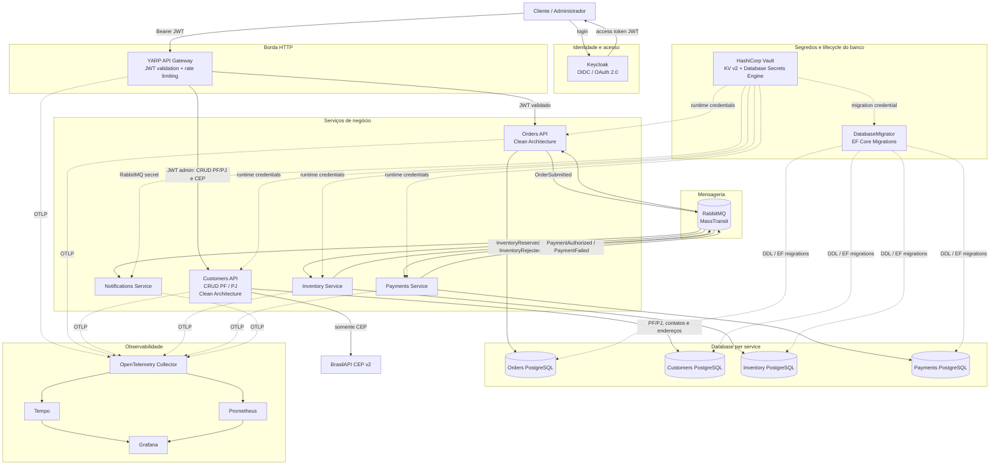
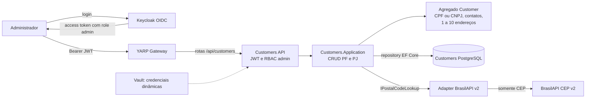

<div align="center">

[🇺🇸 English](README.en.md)

# Distributed Commerce Platform

### .NET 10 · Aspire · Clean Architecture · YARP · RabbitMQ · Keycloak · Vault · OpenTelemetry · AI Engineering Harness

[](https://github.com/WillianZanutoOliveira/distributed-commerce-platform/actions/workflows/ci.yml)


**[Arquitetura](docs/architecture.md) · [Segurança / Pentest readiness](docs/security-posture.md) · [Desenvolvimento local](docs/local-development.md) · [Walkthrough técnico da plataforma](docs/technical-walkthrough.md) · [ADRs](docs/adr) · [Kubernetes](deploy/k8s) · [CI](https://github.com/WillianZanutoOliveira/distributed-commerce-platform/actions/workflows/ci.yml)**

</div>

Plataforma de referência de comércio distribuído, construída com foco em práticas de produção para demonstrar preocupações de engenharia esperadas em posições de **Senior .NET, Tech Lead e Software Architect**.

O sistema modela um fluxo de checkout dividido entre serviços implantáveis de forma independente:

1. O **Keycloak** autentica o usuário e emite o access token OIDC/JWT.
2. O **YARP API Gateway** valida o token na borda, aplica rate limiting e encaminha a requisição autenticada.
3. A **Orders API** valida novamente o JWT, deriva o cliente da claim `sub`, aplica autorização por recurso e persiste o agregado.
4. O pedido é publicado por meio de um **transactional bus outbox**.
5. O **Inventory Service** consome o pedido, toma uma decisão idempotente de reserva e publica o resultado.
6. O **Payments Service** reage a uma reserva bem-sucedida e autoriza ou rejeita o pagamento.
7. **Orders** reage de forma assíncrona ao resultado final do negócio.
8. O **Notifications Service** consome os resultados de pagamento de forma independente.
9. **HashiCorp Vault** fornece segredos e credenciais PostgreSQL dinâmicas separadas entre runtime e migration.
10. **OpenTelemetry** envia traces e métricas para o stack de observabilidade.


Além do checkout, a plataforma disponibiliza um **cadastro administrativo independente de pessoas físicas e jurídicas (Customers)**, com CRUD, CPF/CNPJ, contatos, endereços e consulta de CEP. Esse fluxo usa o mesmo Keycloak e Gateway, mas possui banco e limite de domínio próprios; não cria identidades automaticamente no Keycloak nem se acopla à mensageria de Orders.

O projeto foca intencionalmente nas partes difíceis de sistemas distribuídos, em vez de trabalho de interface.

---

## Por que este projeto existe

O objetivo é tornar visível, em um portfólio público, engenharia backend de nível avançado:

- Clean Architecture e inversão de dependência;
- modelagem de domínio e invariantes de agregados;
- mensageria assíncrona com RabbitMQ;
- colaboração entre serviços orientada a eventos;
- padrões transactional outbox/inbox com MassTransit + EF Core;
- processamento idempotente de mensagens;
- consistência eventual;
- retries e isolamento de falhas;
- database-per-service;
- PostgreSQL;
- API Gateway com YARP, autenticação na borda e rate limiting por identidade;
- gestão centralizada de segredos com HashiCorp Vault e policies por workload;
- credenciais PostgreSQL dinâmicas com Database Secrets Engine, TTL, lease renewal e revogação;
- traces e métricas com OpenTelemetry, Tempo, Prometheus e Grafana;
- Docker e Docker Compose;
- orquestração local com .NET Aspire 13.6 e dashboard integrado;
- Service Defaults compartilhados com readiness/liveness, service discovery e resiliência HTTP;
- health endpoints preparados para Kubernetes;
- quality gates em CI/CD;
- baseline semanal de performance com k6 e thresholds de SLO técnico;
- testes automatizados, cobertura e integração com PostgreSQL real via Testcontainers;
- Clean Code com SonarAnalyzer, .editorconfig e dotnet format;
- DevSecOps com CodeQL, Gitleaks, Trivy, OWASP ZAP DAST, SBOM e OpenSSF Scorecard;
- GitHub Actions pinadas por commit SHA e releases OCI no GHCR com provenance attestations via OIDC/Sigstore;
- autenticação OpenID Connect, validação JWT, RBAC e autorização por recurso com Keycloak;
- OpenAPI nativo do ASP.NET Core validado no teste de topologia;
- harness de engenharia assistida por IA com build/test e entrega somente por pull request;
- registros de decisões arquiteturais.

---

## Arquitetura



### Fluxo de autenticação e autorização

```text
Cliente
  |
  | autentica
  v
Keycloak
  |
  | access token JWT
  v
YARP API Gateway
  |
  | valida issuer / audience / assinatura / expiração
  | aplica rate limiting
  v
Orders API
  |
  | valida JWT novamente
  | usa claim sub como CustomerId
  | aplica RBAC + ownership do recurso
  v
Domínio / PostgreSQL
```

O Gateway não torna o serviço interno implicitamente confiável: **Orders valida o token novamente**. Essa defesa em profundidade evita depender exclusivamente da borda para autenticação e autorização.

Mais detalhes: [documentação de arquitetura](docs/architecture.md) · [walkthrough técnico da plataforma](docs/technical-walkthrough.md)

---

## Limites dos serviços

| Componente | Responsabilidade | Persistência | Integração / Segurança |
| --- | --- | --- | --- |
| Keycloak | identidade, autenticação OIDC/OAuth 2.0 e realm roles | dados internos do IdP | emite JWT para clientes |
| YARP API Gateway | entrada HTTP, validação JWT, rate limiting e proxy reverso | stateless | encaminha apenas requisições autenticadas |
| Orders API | ciclo de vida do pedido, autorização por recurso e API voltada ao cliente | PostgreSQL | publica + consome eventos |
| Customers API | cadastro administrativo de pessoa física/jurídica, contatos e endereços | PostgreSQL | JWT/RBAC + BrasilAPI CEP v2 |
| Inventory Service | decisão idempotente de reserva de estoque | PostgreSQL | consome + publica eventos |
| Payments Service | decisão de autorização de pagamento | PostgreSQL | consome + publica eventos |
| Notifications Service | reação independente de comunicação com cliente | demo stateless | consome eventos |
| RabbitMQ | transporte assíncrono entre bounded contexts | filas / exchanges | MassTransit, at-least-once |
| HashiCorp Vault | secrets, policies e credenciais PostgreSQL dinâmicas | storage do Vault | token/policy por workload |
| DatabaseMigrator | aplica EF Core Migrations antes do workload | usa o banco alvo | identidade Vault migration separada |
| OpenTelemetry | coleta vendor-neutral de traces e métricas | backend externo | OTLP para Collector/Tempo/Prometheus |

Cada serviço com estado possui seu próprio banco de dados. Nenhum serviço lê tabelas pertencentes a outro serviço. Keycloak e Vault são **componentes de plataforma**, não bounded contexts de negócio.


## Clean Architecture

Os bounded contexts de **Orders** e **Customers** usam Clean Architecture com direção explícita de dependências. Em Customers, CPF/CNPJ são validados localmente e a integração externa fica atrás da porta `IPostalCodeLookup`.

O bounded context de **Orders** é dividido em camadas explícitas:

```text
Orders.Domain
      ↑
Orders.Application
      ↑
Orders.Infrastructure
      ↑
Orders.Api
```

O domínio não conhece EF Core, RabbitMQ nem ASP.NET Core.

A camada de aplicação depende de portas como:

- `IOrderRepository`
- `IUnitOfWork`
- `IIntegrationEventPublisher`

A infraestrutura implementa essas portas com PostgreSQL, EF Core e MassTransit.

Serviços menores, focados apenas em eventos, usam deliberadamente uma estrutura mais leve. Isso é intencional: o projeto demonstra que a arquitetura deve acompanhar a complexidade do serviço em vez de replicar camadas mecanicamente.

---

## Padrões de confiabilidade

### Transactional outbox

A Orders API usa o **Bus Outbox** do MassTransit com EF Core.

O estado do pedido e a intenção de envio da mensagem `OrderSubmitted` participam do mesmo limite de persistência. A requisição HTTP não precisa de uma transação distribuída entre PostgreSQL e RabbitMQ.

### Consumer inbox/outbox

Os consumers de Inventory, Payments e Orders usam a integração de outbox com EF Core para suportar proteção contra duplicidade e publicação confiável de mensagens de saída.

### Idempotência

Inventory e Payments persistem uma decisão única por `OrderId`, evitando reservas ou pagamentos duplicados em caso de reentrega de eventos de negócio.

### Consistência eventual

A API retorna inicialmente um pedido no estado `Pending`. Depois, de forma assíncrona, o estado passa para `Completed`, `InventoryRejected` ou `PaymentFailed`.

Essa é uma escolha arquitetural deliberada de sistema distribuído.

---

## Fluxo completo: identidade + pedido + eventos

```text
Cliente
  |
  +--> Keycloak ------------------------------+
  |       |                                   |
  |       +--> access token JWT               |
  |                                           v
  +--------------------------------------> YARP Gateway
                                               |
                                               v
                                         POST /api/orders
                                               |
                                               v
                                           Orders
                                               |
                                               v
                                         OrderSubmitted
                                               |
                                               v
                                      Inventory Service
                                         /          \
                                        v            v
                                  Reserved        Rejected
                                     |               |
                                     v               +----> Orders -> InventoryRejected
                                  Payments
                                  /      \
                                 v        v
                              Paid      Failed
                               |           |
                               +-----------+---------> Orders
                               |
                               +---------------------> Notifications
```

A autenticação é síncrona apenas na borda HTTP. A colaboração entre os bounded contexts de negócio permanece assíncrona por RabbitMQ.

## Cadastro PF/PJ e endereços

O microserviço **Customers** implementa o **CRUD completo de pessoas físicas (PF) e jurídicas (PJ)** como um bounded context administrativo independente de Orders. A implementação segue Clean Architecture (`Customers.Domain`, `Customers.Application`, `Customers.Infrastructure` e `Customers.Api`), usa PostgreSQL próprio e expõe a API pelo **YARP Gateway**. O diagrama de arquitetura acima inclui Customers, Keycloak, BrasilAPI, Vault e o banco exclusivo de cadastro.


### Jornada do cadastro de pessoas



O cadastro é **síncrono e separado da jornada de pedidos**: a API valida CPF/CNPJ localmente, aplica as regras do agregado e persiste apenas no banco Customers. A consulta CEP retorna sugestões de endereço, mas não grava automaticamente o cadastro. A autorização `admin` é revalidada em Customers; não existe provisionamento automático de usuário no Keycloak ou associação automática com Orders. Veja o [fluxo arquitetural detalhado](docs/architecture.md#fluxo-do-cadastro-de-pessoas-pf-e-pj).

### Operações disponíveis

| Método | Rota pública (Gateway) | Resultado e finalidade |
| --- | --- | --- |
| `POST` | `/api/customers` | `201 Created` — cria pessoa física ou jurídica e seus endereços |
| `GET` | `/api/customers/{id}` | `200 OK` / `404 Not Found` — consulta cadastro por GUID |
| `GET` | `/api/customers` | `200 OK` — pesquisa paginada e filtrada |
| `PUT` | `/api/customers/{id}` | `200 OK` / `404 Not Found` — substitui dados e endereços; permite ativar/inativar |
| `DELETE` | `/api/customers/{id}` | `204 No Content` / `404 Not Found` — **exclusão física** do agregado |
| `GET` | `/api/customers/address/cep/{cep}` | `200 OK` / `404 Not Found` / `503 Service Unavailable` — consulta CEP na BrasilAPI v2 |

A listagem aceita `search` (texto), `document` (CPF/CNPJ), `personType` (`Individual` ou `Company`), `page` e `pageSize`. O padrão é página 1, 20 itens por página, com limite de 100. A resposta inclui `items`, `page`, `pageSize`, `totalCount` e `totalPages`.

### Dados cadastrais e validações

| Cadastro | Campos e regras |
| --- | --- |
| **Pessoa física — `Individual`** | `document` (CPF válido), `displayName` (nome), `birthDate` (opcional, anterior à data atual), `email`, `phone` e `addresses`. Campos exclusivos de PJ não são aceitos. |
| **Pessoa jurídica — `Company`** | `document` (CNPJ válido), `displayName` (nome fantasia), `legalName` (razão social obrigatória), `foundationDate` (opcional, não futura), `stateRegistration` e `municipalRegistration` (opcionais), `email`, `phone` e `addresses`. |
| **Endereços de PF e PJ** | De **1 a 10** por cadastro, **exatamente um `isPrimary: true`**. Campos: `type` (`Primary`, `Billing`, `Shipping` ou `Other`), `postalCode`, `street`, `number`, `city` e `state`; opcionais: `complement`, `neighborhood`, `ibgeCityCode`, `latitude` e `longitude`. |

CPF/CNPJ são normalizados, validados pelos dígitos verificadores e protegidos contra duplicidade por índice único no banco (`409 Conflict` em caso de documento repetido). CEP é normalizado para oito dígitos, UF para duas letras, e-mail é validado e telefone é normalizado. O tipo da pessoa **não pode mudar depois da criação**; o `PUT` recebe o cadastro completo, incluindo a coleção de endereços e `isActive`. O `DELETE` exclui o registro, enquanto `isActive: false` apenas o inativa.

### Exemplos de criação pela API

Os dados abaixo são **fixtures fictícias de desenvolvimento** (não utilizar para cadastros reais). O acesso exige um **JWT do Keycloak com role `admin`**, também validado dentro de Customers; um token `customer` não autoriza consultas nem gravações. Os exemplos assumem o Gateway local em `http://localhost:8080` e a variável `ADMIN_TOKEN` contendo um JWT administrativo válido.

**Pessoa física:**

```bash
curl -i -X POST http://localhost:8080/api/customers \
  -H "Authorization: Bearer $ADMIN_TOKEN" \
  -H "Content-Type: application/json" \
  -d '{
    "personType": "Individual",
    "document": "111.444.777-35",
    "displayName": "Pessoa Exemplo",
    "birthDate": "1990-01-01",
    "email": "pf@example.invalid",
    "phone": "(44) 99999-0000",
    "addresses": [{
      "type": "Primary",
      "isPrimary": true,
      "postalCode": "87000-000",
      "street": "Rua Exemplo",
      "number": "100",
      "neighborhood": "Centro",
      "city": "Maringa",
      "state": "PR"
    }]
  }'
```

**Pessoa jurídica:**

```bash
curl -i -X POST http://localhost:8080/api/customers \
  -H "Authorization: Bearer $ADMIN_TOKEN" \
  -H "Content-Type: application/json" \
  -d '{
    "personType": "Company",
    "document": "11.222.333/0001-81",
    "displayName": "Empresa Exemplo",
    "legalName": "Empresa Exemplo LTDA",
    "foundationDate": "2020-01-01",
    "stateRegistration": "ISENTO",
    "email": "pj@example.invalid",
    "phone": "44999990000",
    "addresses": [{
      "type": "Primary",
      "isPrimary": true,
      "postalCode": "87000-000",
      "street": "Avenida Exemplo",
      "number": "200",
      "city": "Maringa",
      "state": "PR"
    }]
  }'
```

**Consulta, filtro e CEP:**

```bash
curl -H "Authorization: Bearer $ADMIN_TOKEN" \
  "http://localhost:8080/api/customers?personType=Individual&page=1&pageSize=10"

curl -H "Authorization: Bearer $ADMIN_TOKEN" \
  "http://localhost:8080/api/customers/address/cep/01001000"
```

O `GET` por CEP consulta **BrasilAPI CEP v2** por uma porta de aplicação (`IPostalCodeLookup`) com cliente HTTP, timeout e resiliência. Ele retorna logradouro, bairro, cidade, UF, código IBGE e coordenadas **quando disponibilizados pelo provedor**; não grava automaticamente o endereço no cadastro. Somente o CEP é enviado à BrasilAPI, **nunca CPF/CNPJ**. Uma indisponibilidade do provedor retorna `503`, e CEP não encontrado retorna `404`.

### Segurança, persistência e testes

- **Keycloak + RBAC:** todas as rotas de Customers, inclusive a consulta de CEP, exigem role `admin`; Gateway e API validam o JWT. Ausência de autenticação retorna `401`, usuário sem permissão recebe `403`; entradas inválidas retornam respostas de validação `400`.
- **Isolamento e credenciais:** PostgreSQL exclusivo de Customers; EF Core Migrations aplicadas com a identidade `customers_migrator` (DDL), diferente de `customers_runtime` (DML). O Vault fornece credenciais dinâmicas em execução segura.
- **Execução local:** o serviço participa do .NET Aspire e do Docker Compose. Consulte o [guia de desenvolvimento local](docs/local-development.md) para subir Keycloak, Vault, Gateway e dependências.
- **Validação automatizada:** com os recursos locais ativos, execute `bash scripts/customers-smoke.sh` (usa `curl` e `jq`, usuário fictício `demo-admin` da configuração local). O script cobre CRUD PF/PJ via Gateway, autorização, atualização de endereço, paginação, duplicidade e exclusão; existem também testes de domínio, infraestrutura e regressão de persistência.

**Limites atuais:** o cadastro é uma **API administrativa**, não uma interface gráfica pronta; a criação de um cliente não provisiona automaticamente um usuário no Keycloak nem vincula o cadastro a um pedido em Orders. Para decisões arquiteturais e segurança, consulte [ADR-0013](docs/adr/0013-customers-pf-pj-brasilapi-cep.md), [arquitetura](docs/architecture.md) e [postura de segurança](docs/security-posture.md).

---

## Executando localmente

### Caminho recomendado: .NET Aspire

Requisitos:

- .NET 10 SDK;
- Docker ou Podman compatível com Aspire.

Inicie toda a plataforma com um comando:

```bash
dotnet run --project src/Platform/DistributedCommerce.AppHost
```

O AppHost sobe PostgreSQL, RabbitMQ, Keycloak e Vault, executa o bootstrap das credenciais dinâmicas, inicia Gateway + cinco serviços como projetos locais e abre o Aspire Dashboard com logs, traces, métricas, endpoints e estado dos recursos.

As senhas administrativas locais são geradas pelo secret store do Aspire; os tokens scoped do Vault são gravados apenas em `.aspire/vault-tokens`, diretório ignorado pelo Git.

Veja o [guia completo de desenvolvimento local](docs/local-development.md) e o [ADR-0008](docs/adr/0008-dotnet-aspire-local-orchestration.md).

### Caminho de paridade/CI: Docker Compose

O Compose seguro continua sendo suportado e é o caminho exercitado pelo CI:

```bash
cp .env.example .env
docker compose -f docker-compose.yml -f docker-compose.vault.yml up --build
```

O `docker-compose.yml` simples continua disponível para estudo; o overlay `docker-compose.vault.yml` mantém Vault e credenciais PostgreSQL dinâmicas.

Endpoints:

| Componente | URL |
| --- | --- |
| API Gateway | http://localhost:8080 |
| Orders API | http://localhost:8081 |
| Orders health | http://localhost:8081/health |
| Inventory health | http://localhost:8082/health |
| Payments health | http://localhost:8083/health |
| Notifications health | http://localhost:8084/health |
| RabbitMQ Management | http://localhost:15672 |
| Keycloak | http://localhost:8180 |
| Vault | http://localhost:8200 |
| Grafana | http://localhost:3000 |
| Prometheus | http://localhost:9090 |
| Tempo | http://localhost:3200 |

Obtenha um token do usuário local de demonstração:

```bash
TOKEN=$(curl -s -X POST http://localhost:8180/realms/distributed-commerce/protocol/openid-connect/token \
  -H "Content-Type: application/x-www-form-urlencoded" \
  -d "grant_type=password" \
  -d "client_id=commerce-cli" \
  -d "username=demo-customer" \
  -d "password=local-demo-only" | jq -r .access_token)
```

Crie um pedido autenticado. O CustomerId é derivado da claim sub do token e não é aceito do payload:

```bash
curl -X POST http://localhost:8080/api/orders \
  -H "Authorization: Bearer $TOKEN" \
  -H "Content-Type: application/json" \
  -d '{
    "items": [
      { "sku": "NOTEBOOK-01", "quantity": 1, "unitPrice": 3499.90 }
    ]
  }'
```

Consulte o status assíncrono:

```bash
curl http://localhost:8080/api/orders/{order-id} \
  -H "Authorization: Bearer $TOKEN"
```

### Caminhos de falha para demonstração

O exemplo possui políticas determinísticas para permitir testar o fluxo distribuído sem provedores externos:

- quantidade de um item acima de **10** gera `InventoryRejected`;
- total do pedido acima de **5.000** gera `PaymentFailed`.

Essas regras são intencionalmente simples; o foco está na arquitetura ao redor delas.

---

## Segurança e identidade

A Orders API valida access tokens emitidos pelo Keycloak. Assinatura, emissor, audiência e expiração são verificados, e roles do realm alimentam policies de autorização.

O CustomerId do pedido é derivado da claim sub; ele não é mais confiado ao payload. Usuários com role customer acessam apenas os próprios pedidos, enquanto admin pode consultar pedidos entre clientes.

O realm local versionado existe para demonstração e smoke tests. O fluxo de senha direta é apenas um fixture local; clientes interativos reais devem usar Authorization Code + PKCE.

Veja [ADR-0004](docs/adr/0004-identity-keycloak.md).

### Pentest readiness

A segurança é tratada como **propriedade verificável**, não como promessa de “zero vulnerabilidades”.

O projeto aplica:

- JWT assinado RS256, issuer/audience/lifetime e HTTPS obrigatório para Keycloak fora de Development;
- query de Orders escopada por `OrderId + CustomerId`, evitando exposição de recursos de outro cliente;
- rate limiting por identidade;
- limites de body/headers/request line;
- JSON estrito, propriedades desconhecidas rejeitadas e inputs de negócio limitados;
- headers HTTP de segurança e remoção do header `Server`;
- containers non-root e hardening do perfil Compose seguro;
- CodeQL + Gitleaks + Trivy vuln/secret/misconfig;
- **OWASP ZAP API Scan ativo autenticado** contra uma stack descartável Keycloak → YARP → Orders;
- smoke adversarial de JWT inválido, TRACE, mass assignment, oversized body e rate limiting.

O objetivo do gate é manter **zero findings High/Critical conhecidos**, sem esconder finding para “deixar o CI verde”. Um pentest manual independente continua recomendado antes de produção real.

Veja [postura de segurança e pentest readiness](docs/security-posture.md).

### Cofre de segredos

O perfil seguro usa HashiCorp Vault em duas camadas. RabbitMQ permanece no KV v2, enquanto PostgreSQL usa o Database Secrets Engine: Orders, Inventory e Payments recebem um login temporário exclusivo, com TTL e lease renovável. Cada workload recebe seu próprio token por arquivo montado e só pode ler/renovar os paths associados à sua identidade.

O connection string PostgreSQL é montado apenas em memória. O ambiente do container mantém `ConnectionStrings__*-db` vazio, e o serviço encerra o host se não conseguir renovar o lease — comportamento fail closed.

Em produção, o modo dev/root token não é usado: a preferência é identidade de plataforma (por exemplo, Kubernetes Auth), token curto, TLS, auditoria e uma identidade administrativa dedicada do Vault no PostgreSQL. Veja [gestão de segredos](docs/secrets-management.md), [ADR-0006](docs/adr/0006-secrets-hashicorp-vault.md) e [ADR-0007](docs/adr/0007-dynamic-postgresql-credentials.md).

---

## Database migrations e least privilege

O schema não é mais criado pelo runtime. Orders, Inventory e Payments possuem **EF Core Migrations versionadas** e um `DatabaseMigrator` one-shot.

A separação é explícita:

```text
Vault <service>-migration
        |
        v
temporary PostgreSQL login
        |
        v
<service>_migrator
        |
        +--> DDL / EF Migrations

Vault <service>-app
        |
        v
temporary PostgreSQL login
        |
        v
<service>_runtime
        |
        +--> DML only
```

Compose e Aspire aguardam o migrator terminar antes de iniciar o workload. No modelo Kubernetes/GitOps, a mesma operação acontece como Argo CD `PreSync` Job. O CI falha se `EnsureCreatedAsync` reaparecer ou se a role runtime recuperar `CREATE` no schema.

Veja [ADR-0011](docs/adr/0011-ef-migrations-vault-deployment-identity.md).

---

## Service Defaults e proteção de borda

Todos os workloads usam um building block compartilhado alinhado ao padrão do Aspire:

- `/health` para readiness;
- `/alive` para liveness;
- OpenTelemetry compartilhado;
- service discovery;
- Standard Resilience Handler para futuros `HttpClient`.

O YARP Gateway aplica token bucket rate limiting por identidade autenticada (`sub`), com fallback para IP. Orders publica `/openapi/v1.json` em Development, e o teste de topologia Aspire valida o documento automaticamente.

Veja [ADR-0009](docs/adr/0009-service-defaults-api-resilience.md).

---

## Software supply chain

Além de CodeQL/Trivy/SBOM, o repositório automatiza:

- OpenSSF Scorecard semanal com resultados em SARIF/Code Scanning;
- GitHub Actions referenciadas por SHA imutável;
- `CODEOWNERS` e `SECURITY.md`;
- publicação automática de seis imagens OCI no GHCR quando uma tag `v*` é criada;
- attestation criptográfica de cada digest OCI com GitHub OIDC + Sigstore.

Exemplo de release:

```bash
git tag v1.0.0
git push origin v1.0.0
```

A origem da imagem publicada pode então ser verificada com `gh attestation verify`.

Veja [ADR-0010](docs/adr/0010-software-supply-chain.md).

---

## AI Engineering Harness

O [AI Evolution Harness](.github/workflows/ai-evolution.yml) **já está instalado na `main`** desde o merge humano do [PR #19](https://github.com/WillianZanutoOliveira/distributed-commerce-platform/pull/19) (`d5f76b272d3b02826bd7b16eb4d032412bc5a015`). As etapas são isoladas: `engineer` (Codex com token GitHub de leitura), `validate` (guard de governança em runner independente + quality gates) e `publish` (verifica SHA-256 do patch, abre somente branch/PR e solicita CI, Security e DAST). Os arquivos de governança e o próprio guard ficam protegidos de alterações pelo agente.

**Status operacional:** a instalação e os checks de PR de governança foram confirmados, mas **a primeira execução ponta a ponta ainda não foi validada**. É preciso confirmar `OPENAI_API_KEY` como secret, permissões de Actions e executar manualmente `workflow_dispatch` na `main` com uma tarefa documental inofensiva. A [issue #15](https://github.com/WillianZanutoOliveira/distributed-commerce-platform/issues/15) acompanha esse aceite; não há auto-merge ou deploy pelo agente.

**Evolução documentada:** [PR #17 — guard e testes](https://github.com/WillianZanutoOliveira/distributed-commerce-platform/pull/17) · [PR #18 — proposta de governança](https://github.com/WillianZanutoOliveira/distributed-commerce-platform/pull/18) · [PR #19 — workflow instalado](https://github.com/WillianZanutoOliveira/distributed-commerce-platform/pull/19). Veja [operação e primeiro teste AI-First](docs/ai-first-operations.md) e [ADR-0005](docs/adr/0005-ai-engineering-harness.md).

---

## Observabilidade

Todos os serviços usam um building block compartilhado de OpenTelemetry. No inner loop com Aspire, o Dashboard agrega recursos, logs, traces e métricas. O perfil Docker Compose continua incluindo OpenTelemetry Collector, Tempo, Prometheus e Grafana para demonstrar uma topologia de observabilidade independente do Aspire, com:

- `ActivitySource` para spans de trace distribuído;
- métricas customizadas de processamento de mensagens;
- exportação OTLP quando `OTEL_EXPORTER_OTLP_ENDPOINT` está configurado;
- exportação em console como fallback local.

Isso mantém a telemetria independente de fornecedor.

---

## CI/CD

O GitHub Actions valida toda mudança relevante com:

1. restore de dependências;
2. build em Release;
3. validação explícita do .NET Aspire AppHost;
4. testes automatizados;
5. coleta de cobertura de código;
6. quality gate Sonar/.editorconfig/dotnet format;
7. testes de integração com PostgreSQL real via Testcontainers;
8. Architecture Tests, Contract Compatibility Tests e fault injection com Toxiproxy;
9. build do container de API Gateway;
10. build do container de Orders;
11. build do container de Inventory;
12. build do container de Payments;
13. build do container de Notifications;
14. build do DatabaseMigrator;
15. validação do Compose seguro;
16. smoke test real Keycloak → YARP → Orders;
17. execução de EF Core Migrations com identidade Vault separada;
18. prova de least privilege: runtime sem DDL e migrator com CREATE;
19. verificação de credencial PostgreSQL dinâmica, connection string ausente do environment e lease renewal;
20. workflow de segurança com CodeQL, Trivy e SBOM.

O Dependabot monitora dependências NuGet e GitHub Actions.

---

## Architecture, contract e chaos tests

A solução possui quality gates executáveis para propriedades que testes unitários não cobrem sozinhos:

- **Architecture Tests** impedem referências proibidas entre Domain, Application, Infrastructure, Contracts e bounded contexts;
- **Contract Compatibility Tests** protegem o shape dos integration events publicados;
- **Chaos Tests** usam Testcontainers + Toxiproxy para cortar e restaurar conectividade PostgreSQL e comprovar falha/recovery.

Veja [ADR-0012](docs/adr/0012-architecture-contract-chaos-gitops.md).

---

## GitOps e canary deployment

`deploy/gitops` demonstra uma estratégia declarativa com **Argo CD + Argo Rollouts + Vault Kubernetes Auth**:

```text
tag v*
  -> imagens/attestations no GHCR
  -> GitOps Promotion abre PR
  -> review + merge
  -> Argo CD PreSync migration
  -> canary 20% -> analysis -> 50% -> analysis -> 100%
```

CI não executa `kubectl apply` em produção. Git é a fonte de verdade e o promotion workflow nunca faz auto-merge.

Veja [guia GitOps](deploy/gitops/README.md) e [ADR-0012](docs/adr/0012-architecture-contract-chaos-gitops.md).

---

## Performance baseline

O workflow [Performance Baseline](.github/workflows/performance.yml) executa k6 semanalmente ou sob demanda contra a Orders API usando a stack segura com Keycloak, Vault, PostgreSQL e RabbitMQ.

A baseline falha quando o erro HTTP chega a 1%, quando menos de 99% das criações retornam HTTP 201 ou quando o p95 supera 1 segundo. O objetivo é detectar regressões sem tornar cada PR mais lento.

Veja [documentação de performance](docs/performance.md).

---

## Kubernetes

O repositório inclui exemplos de deployment orientados a Kubernetes em [deploy/k8s](deploy/k8s/README.md).

Eles demonstram:

- probes de liveness e readiness;
- requests e limits de recursos;
- separação entre ConfigMap e Secret;
- serviços escaláveis de forma independente;
- containers de aplicação stateless.

RabbitMQ e PostgreSQL são tratados como dependências de plataforma que, em produção, normalmente seriam fornecidas por serviços gerenciados ou operadores dedicados.

---

## Decisões de arquitetura

- [ADR-0001 — Serviços orientados a eventos e Clean Architecture](docs/adr/0001-event-driven-clean-architecture.md)
- [ADR-0002 — Transactional outbox em vez de transações distribuídas](docs/adr/0002-transactional-outbox.md)
- [ADR-0003 — Idempotência e consistência eventual](docs/adr/0003-idempotency-eventual-consistency.md)
- [ADR-0004 — Identidade e autorização com Keycloak](docs/adr/0004-identity-keycloak.md)
- [ADR-0005 — Harness de engenharia assistida por IA](docs/adr/0005-ai-engineering-harness.md)
- [ADR-0006 — Gestão centralizada de segredos com HashiCorp Vault](docs/adr/0006-secrets-hashicorp-vault.md)
- [ADR-0007 — Credenciais PostgreSQL dinâmicas com Vault Database Secrets Engine](docs/adr/0007-dynamic-postgresql-credentials.md)
- [ADR-0008 — .NET Aspire como orquestrador de desenvolvimento local](docs/adr/0008-dotnet-aspire-local-orchestration.md)
- [ADR-0009 — Service Defaults, health model, OpenAPI e proteção de borda](docs/adr/0009-service-defaults-api-resilience.md)
- [ADR-0010 — Software supply chain e releases atestados](docs/adr/0010-software-supply-chain.md)
- [ADR-0011 — EF Core Migrations com identidade Vault de deployment separada](docs/adr/0011-ef-migrations-vault-deployment-identity.md)
- [ADR-0012 — Guardrails arquiteturais, contratos, fault injection e progressive delivery](docs/adr/0012-architecture-contract-chaos-gitops.md)

---

## Estrutura do repositório

```text
src/
├── BuildingBlocks/
│   ├── Contracts/
│   ├── Observability/
│   ├── Security/
│   └── Secrets/
├── Gateway/
│   └── ApiGateway/
├── Platform/
│   ├── DistributedCommerce.AppHost/
│   └── DatabaseMigrator/
└── Services/
    ├── Orders/
    │   ├── Orders.Domain/
    │   ├── Orders.Application/
    │   ├── Orders.Infrastructure/
    │   └── Orders.Api/
    ├── Inventory/
    ├── Payments/
    └── Notifications/

tests/
├── Architecture.Tests/
├── Chaos.Tests/
├── Contracts.Compatibility.Tests/
├── DistributedCommerce.AppHost.Tests/
├── Orders.Domain.Tests/
└── Orders.Persistence.IntegrationTests/

docs/
├── architecture.md
└── adr/

deploy/
└── k8s/
```

---

## Trade-offs de engenharia

Esta é uma implementação de portfólio/referência, não uma afirmação de que todo sistema deveria usar microsserviços.

Um monólito modular seria preferível para muitos produtos menores. Este projeto usa serviços distribuídos intencionalmente para tornar visíveis preocupações que aparecem quando os limites são separados: garantias de entrega, idempotência, transições assíncronas de estado, persistência independente, política de retries, saúde operacional e observabilidade.

Esse trade-off é documentado de forma explícita.
