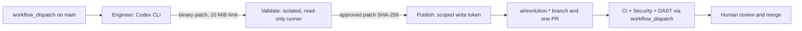

[🇧🇷 Português](ai-first-operations.md)

# Secure AI-First agent operations

## Verified status — October 10, 2026

**Workflow installed on `main`; end-to-end execution not yet confirmed.** The maintainer merged [PR #17](https://github.com/WillianZanutoOliveira/distributed-commerce-platform/pull/17), [PR #18](https://github.com/WillianZanutoOliveira/distributed-commerce-platform/pull/18), and [PR #19](https://github.com/WillianZanutoOliveira/distributed-commerce-platform/pull/19). The active workflow is [.github/workflows/ai-evolution.yml](../.github/workflows/ai-evolution.yml), present on `main` since commit `d5f76b272d3b02826bd7b16eb4d032412bc5a015`.

PR #19 passed [CI](https://github.com/WillianZanutoOliveira/distributed-commerce-platform/actions/runs/38084752616) and [Security](https://github.com/WillianZanutoOliveira/distributed-commerce-platform/actions/runs/38084752611). This validates the governance change through PR checks; **it does not prove Codex has run, secrets are configured, or automated PR publication works**. As of the October 10, 2026 check, no successful `AI Evolution Harness` run was confirmed. [Issue #15](https://github.com/WillianZanutoOliveira/distributed-commerce-platform/issues/15) remains open until an end-to-end smoke test succeeds.

## Workflow architecture



| Job | Permissions and responsibilities |
| --- | --- |
| `engineer` | `contents: read`, no persisted GitHub credentials; runs Codex with `OPENAI_API_KEY` and exports a patch without creating a PR |
| `validate` | `contents: read`; imports the patch in an isolated runner, saves a trusted guard **before** patch application, runs Python fixtures, .NET restore/Release build/tests/format, static security checks and Compose validation |
| `publish` | `contents: write`, `pull-requests: write`, `actions: write`; rechecks the same patch SHA-256 and guard, opens one branch/PR and dispatches CI/Security/DAST; **never merges** |

Third-party GitHub Actions are pinned to commit SHAs. Execution is manual, serialized per repository, and limited to small tasks. The patch artifact is retained for three days; the workflow has no production deployment step.

## GitHub prerequisites

1. In **Settings → Secrets and variables → Actions**, confirm `OPENAI_API_KEY` exists as a **repository secret**. Never paste the key into chat, issues, files, or logs; use a dedicated API credential with suitable spending limits.
2. In **Settings → Actions → General**, check `GITHUB_TOKEN` permissions and whether GitHub Actions is allowed to create pull requests. The `publish` job needs contents/PR write scopes and permission to dispatch workflows; avoid unnecessarily broad repository-wide privileges.
3. Verify `main` is selected and the current revision has completed CI/Security checks. The documentation connection **cannot inspect secrets or guarantee that these permissions have been configured**.

## Triggering from the ChatGPT GitHub connector (human-reviewed bridge)

The GitHub integration available in this chat can create **branches and files**, but currently **does not expose** a direct `workflow_dispatch` operation. The governance proposal [`.github/workflows/ai-evolution-request.yml`](../.github/workflows/ai-evolution-request.yml) introduces a bridge triggered by a `push` to a request branch. **It works only after a maintainer reviews and merges this governance change into `main`.**

### Requesting a run from chat

1. Ask ChatGPT: **"Start AI-First for [one small, specific task]"**. Using the connected GitHub integration, the assistant should create a **new** `ai-requests/<unique-id>` branch from `main`.
2. The assistant must **add only** `.ai-requests/task.md`, with the instruction, in **one addition-only commit**. Do not create or modify workflows, secrets, application code, or other files in this request, and never reuse the previous request branch.
3. Once enabled, the bridge checks that the commit parent belongs to `main` history, that this commit **only added** the authorized file, and that its contents are nonempty UTF-8 limited to **4 KiB**. The bridge uses a `GITHUB_TOKEN` scoped to **`contents:read`** and **`actions:write`**, solely to dispatch `ai-evolution.yml` on `main`.
4. Confirm the new run in [GitHub Actions — AI Evolution Harness](https://github.com/WillianZanutoOliveira/distributed-commerce-platform/actions/workflows/ai-evolution.yml), then track `engineer → validate → publish`. The bridge **does not generate, approve, or merge application PRs, and never executes task text as shell**; it only requests the existing harness.

The request branch is **an instruction envelope**, not a PR for merging; the maintainer may delete it after confirming the run. GitHub records push actor, workflow run ID, and commit SHA. Pushes performed with another workflow's **`GITHUB_TOKEN`** normally do not trigger workflows; this bridge targets external pushes authenticated by the connected GitHub App. A real smoke run remains mandatory to verify trigger behavior and permissions.

**Security boundaries:** this does not grant the connector any new native action or broad Actions access. The repository must manage which collaborators can push request branches; those collaborators can request workflows and incur CI/Codex usage. Restrict write access and apply spending limits and optional approval controls. The bridge does not receive `OPENAI_API_KEY`: only the existing harness's `engineer` job accesses it. If repository policy blocks `actions:write`, the dispatch fails visibly and must be resolved by maintainers rather than bypassed.

The GitHub REST endpoint is `POST /repos/{owner}/{repo}/actions/workflows/ai-evolution.yml/dispatches` with `ref=main` and `inputs.task`. The existing manual `Run workflow` procedure below remains a fallback.

## First controlled run

1. Open [Actions → AI Evolution Harness](https://github.com/WillianZanutoOliveira/distributed-commerce-platform/actions/workflows/ai-evolution.yml), choose **Run workflow**, select `main`, and enter:

   ```text
   Create only docs/ai-first-smoke-test.md and docs/ai-first-smoke-test.en.md,
   explaining in Portuguese and English that this is a harmless AI-First
   workflow test. Do not modify other files, include private data, or merge.
   ```

2. Watch the `engineer`, `validate`, and `publish` jobs. Success requires a new `ai/evolution-<run>-<attempt>` branch and exactly **one reviewable pull request**, without changing `main` automatically.
3. Check that CI, Security, and DAST were actually **completed successfully** on the created branch, including explicitly dispatched `workflow_dispatch` jobs; merely scheduling them is insufficient.
4. Perform human diff review and ensure only the two docs were added. Do not auto-merge. Record the run and PR links in [issue #15](https://github.com/WillianZanutoOliveira/distributed-commerce-platform/issues/15).

**Acceptance gate:** installing YAML is not enough. Consider the harness operational only after a successful end-to-end smoke run with a valid API credential, published PR, and independent checks.

## Troubleshooting

| Symptom | Check |
| --- | --- |
| `Require OpenAI API credential` fails | Missing or empty Actions secret `OPENAI_API_KEY` |
| `engineer` fails | Codex logs and pinned CLI version (`@openai/codex@0.160.0`); do not expose the token |
| `validate` rejects the patch | Protected paths, trusted guard, restore/build/test/format, Compose, or immutable base SHA |
| `publish` fails | Patch SHA-256, token scopes, permission to create branch/PR and dispatch workflows |
| PR exists but checks are missing | Check the CI/Security/DAST runs on the generated branch and any required workflow approvals |

Do not bypass the guard, branch rules, or quality gates to force a green run. Any change to the protected workflow requires human governance review.

## Local guard verification

Requires Git and Python 3 without additional Python packages:

```bash
python3 -m unittest discover -s tests/ai_harness -p 'test_*.py' -v
BASE_SHA="$(git rev-parse HEAD)" # capture BEFORE starting the agent
# After the run, use the trusted guard copy saved outside the writable worktree:
python3 /trusted/path/ai-change-guard.py --repo . --base-sha "$BASE_SHA"
```

| Exit code | Meaning |
| --- | --- |
| `0` | Eligible changes exist; no protected path changed |
| `1` | Protected governance file changed, created, removed or renamed |
| `2` | No eligible changes or Git failure; fail closed |

The guard covers **committed changes since an immutable base SHA plus staged, unstaged and untracked paths**, using NUL-delimited Git names and `--no-renames` so a rename cannot hide protected deletion. The base SHA must be a full immutable commit, not `origin/main`. Besides individual files like `AGENTS.md`, the entire `.github/workflows/`, `.ai/`, `docs/governance/`, and `tests/ai_harness/` directories are protected. **Never run a guard copy that the agent might have edited.** The workflow preserves a trusted copy in a separate runner and rechecks before publishing.

See [ADR-0005](adr/0005-ai-engineering-harness.en.md), [AGENTS.md](../AGENTS.md), and the [engineering constitution](../.ai/engineering-constitution.md).
