[🇺🇸 English](ai-first-operations.en.md)

# Operação segura dos agentes AI-First

## Situação verificada — 10/10/2026

**Workflow instalado na `main`; execução ponta a ponta ainda não comprovada.** O mantenedor integrou os [PRs #17](https://github.com/WillianZanutoOliveira/distributed-commerce-platform/pull/17), [#18](https://github.com/WillianZanutoOliveira/distributed-commerce-platform/pull/18) e [#19](https://github.com/WillianZanutoOliveira/distributed-commerce-platform/pull/19). O workflow ativo é [.github/workflows/ai-evolution.yml](../.github/workflows/ai-evolution.yml), presente na `main` desde o commit `d5f76b272d3b02826bd7b16eb4d032412bc5a015`.

O PR #19 passou em [CI](https://github.com/WillianZanutoOliveira/distributed-commerce-platform/actions/runs/38084752616) e [Security](https://github.com/WillianZanutoOliveira/distributed-commerce-platform/actions/runs/38084752611). Isso valida a alteração de governança nos checks de PR, **não comprova que Codex executou, que os secrets estão configurados ou que a publicação automática de PR funciona**. Na última consulta de 10/10/2026, não havia execução `AI Evolution Harness` confirmada. A [issue #15](https://github.com/WillianZanutoOliveira/distributed-commerce-platform/issues/15) permanece aberta até um teste end-to-end passar.

## Arquitetura do workflow

```mermaid
flowchart LR
    A[workflow_dispatch em main] --> E[Engineer: Codex CLI]
    E -->|patch binário, limite 10 MiB| V[Validate: runner isolado, somente leitura]
    V -->|SHA-256 do patch aprovado| P[Publish: token com escrita restrita]
    P --> PR[Branch ai/evolution-* e um PR]
    PR --> CHECK[CI + Security + DAST por workflow_dispatch]
    CHECK --> HUMAN[Revisão e merge humanos]
```



| Job | Permissões e responsabilidades |
| --- | --- |
| `engineer` | `contents: read`, sem credencial Git persistida; usa apenas `OPENAI_API_KEY` para Codex e exporta um patch, sem criar PR |
| `validate` | `contents: read`; importa o patch em runner independente, aplica um guard confiável copiado **antes** do patch e executa Python, restore, build Release, testes, formatação, segurança estática e Compose |
| `publish` | `contents: write`, `pull-requests: write` e `actions: write`; verifica o SHA-256 do mesmo patch e o guard, cria uma branch e um PR e solicita CI, Security e DAST; **não faz merge** |

Actions de terceiros são referenciadas por SHA fixo. A execução é manual, serializada por repositório e limitada a tarefas pequenas. O artefato patch fica retido por três dias; o fluxo não possui deploy em produção.

## Preparação no GitHub

1. Em **Settings → Secrets and variables → Actions**, confirme que `OPENAI_API_KEY` existe como **repository secret**. Não cole a chave no chat, nas issues, em arquivos ou logs; use credencial dedicada e limites de consumo adequados.
2. Em **Settings → Actions → General**, confira permissões do `GITHUB_TOKEN` e se GitHub Actions pode criar pull requests. O job `publish` requer escrita em conteúdo/PRs e permissão para disparar workflows; evite aumentar os privilégios globais do repositório.
3. Confirme que a branch escolhida é `main` e que os checks de CI e Security da versão atual foram concluídos. A conexão usada para documentar este processo **não expõe o estado dos secrets nem permite garantir que as permissões estejam configuradas**.

## Disparo pelo conector GitHub do ChatGPT (ponte com revisão humana)

A integração GitHub disponível neste chat pode criar **branches e arquivos**, mas atualmente **não disponibiliza** uma ação direta para `workflow_dispatch`. A proposta de governança [`.github/workflows/ai-evolution-request.yml`](../.github/workflows/ai-evolution-request.yml) cria uma ponte usando `push` em uma branch de solicitação. **Ela só entra em funcionamento após revisão e merge humano da mudança de governança na `main`.**

### Como solicitar uma execução pelo chat

1. Peça ao ChatGPT: **"Inicie o AI-First para [tarefa pequena e específica]"**. Com o conector GitHub já conectado, o assistente deverá criar uma **nova branch** no formato `ai-requests/<identificador-unico>` partindo da `main`.
2. Na branch, o assistente deverá **adicionar somente** o arquivo `.ai-requests/task.md`, contendo a instrução, em **um único commit de adição**. Não criar ou modificar workflows, segredos, código nem outros arquivos nessa solicitação; não reutilizar uma branch anterior.
3. O workflow intermediário, se estiver ativo, verifica que o pai do commit pertence ao histórico da `main`, que o commit **apenas adicionou** o arquivo permitido e que a tarefa é UTF-8, não vazia e limitada a **4 KiB**. Ele usa o `GITHUB_TOKEN` **somente** com `contents:read` e `actions:write`, para chamar a API de `workflow_dispatch` do `ai-evolution.yml` em `main`.
4. Confirme o disparo em [GitHub Actions — AI Evolution Harness](https://github.com/WillianZanutoOliveira/distributed-commerce-platform/actions/workflows/ai-evolution.yml) e acompanhe `engineer → validate → publish`. A ponte **não cria nem aprova PR de código, não executa tarefas diretamente e não faz merge**; ela só solicita o início do harness existente.

A branch de solicitação é **apenas um envelope de instrução**, não um PR a ser mesclado; pode ser excluída pelo mantenedor após confirmação do disparo. O workflow mantém rastreabilidade do ator do `push`, ID de execução e SHA. Um `push` realizado pelo **`GITHUB_TOKEN` de outro workflow** normalmente não dispara workflows novos; a ponte destina-se a um `push` externo autenticado pela conexão GitHub App. Um teste real é obrigatório para validar esse comportamento e as permissões na instalação utilizada.

**Limites de segurança:** o conector não ganhou uma nova função nativa e não recebeu permissão irrestrita de Actions. O repositório continua responsável por autenticar quem pode fazer `push` em branches de solicitação; quem tiver essa permissão poderá pedir execuções, com custo de CI/Codex. Mantenha colaboradores com escrita sob controle, configure orçamentos e limites da API, e considere regras adicionais de aprovação quando necessário. O job intermediário não recebe `OPENAI_API_KEY`; somente o `engineer` do harness usa o segredo já configurado. Se `actions:write` for bloqueado nas configurações de Actions, a ponte falhará de forma visível e deverá ser ajustada por um mantenedor, **não contornada**.

O endpoint oficial do GitHub utilizado é `POST /repos/{owner}/{repo}/actions/workflows/ai-evolution.yml/dispatches` com `ref=main` e `inputs.task`. A alternativa manual `Run workflow` documentada abaixo continua disponível.

## Primeira execução controlada

1. Abra [Actions → AI Evolution Harness](https://github.com/WillianZanutoOliveira/distributed-commerce-platform/actions/workflows/ai-evolution.yml), selecione **Run workflow**, escolha `main` e informe a tarefa:

   ```text
   Crie somente docs/ai-first-smoke-test.md e docs/ai-first-smoke-test.en.md,
   explicando em português e inglês que este é um teste inofensivo do fluxo
   AI-First. Não altere outros arquivos, não inclua dados privados e não faça merge.
   ```

2. Acompanhe os jobs `engineer`, `validate` e `publish`. O sucesso exige uma nova branch `ai/evolution-<run>-<attempt>` e exatamente **um pull request revisável**, sem atualização automática da `main`.
3. No PR gerado, confirme **resultados concluídos e aprovados** de CI, Security e DAST, incluindo disparos explícitos por `workflow_dispatch`; agendar os checks não equivale a aprová-los.
4. Revise o diff humano e verifique que apenas os dois documentos foram criados. Não faça merge automático. Registre o link da execução e o PR na [issue #15](https://github.com/WillianZanutoOliveira/distributed-commerce-platform/issues/15).

**Critério de conclusão:** a instalação do YAML não basta. Somente considere o harness operacional após o smoke end-to-end bem-sucedido com segredo válido, publicação e gates independentes.

## Diagnóstico e correção

| Sintoma | O que verificar |
| --- | --- |
| `Require OpenAI API credential` falha | Secret `OPENAI_API_KEY` ausente ou vazio em Actions |
| `engineer` falha | Logs do Codex e versão instalada (`@openai/codex@0.160.0`); não exponha o token |
| `validate` reprova patch | Caminhos protegidos, guard, restore/build/test/format, Compose ou SHA-base |
| `publish` falha | Digest SHA-256, permissões do token, capacidade de criar branch/PR e disparar workflows |
| PR aparece mas checks faltam | Verifique execuções CI/Security/DAST na branch criada e autorizações manuais exigidas |

Não contorne guard, políticas de branch ou checks para fazer o fluxo passar. Falhas de Actions, versões do Codex ou permissões exigem correção revisada por humano quando afetam o workflow protegido.

## Verificação local do guard

Requer Git e Python 3, sem pacotes Python adicionais:

```bash
python3 -m unittest discover -s tests/ai_harness -p 'test_*.py' -v
BASE_SHA="$(git rev-parse HEAD)" # capturar ANTES de iniciar o agente
# Depois da execução, use o guard confiável salvo fora do workspace alterável:
python3 /trusted/path/ai-change-guard.py --repo . --base-sha "$BASE_SHA"
```

| Código | Significado |
| --- | --- |
| `0` | Há alterações e nenhum caminho protegido foi afetado |
| `1` | Arquivo de governança protegido alterado, criado, removido ou renomeado |
| `2` | Nenhuma alteração elegível ou erro de Git; falha fechada |

O guard detecta mudanças **já commitadas desde o SHA-base, staged, unstaged e untracked**; utiliza nomes terminados por NUL e `--no-renames` para não ocultar exclusões. O SHA-base deve ser um commit imutável completo, não `origin/main`. Além de arquivos individuais como `AGENTS.md`, todos os caminhos de `.github/workflows/`, `.ai/`, `docs/governance/` e `tests/ai_harness/` são protegidos. **Nunca execute uma cópia do guard que o próprio agente possa ter alterado.** O workflow mantém essa cópia em um runner separado e repete a checagem antes de publicar.

Consulte [ADR-0005](adr/0005-ai-engineering-harness.md), [AGENTS.md](../AGENTS.md) e a [constituição de engenharia](../.ai/engineering-constitution.md).
