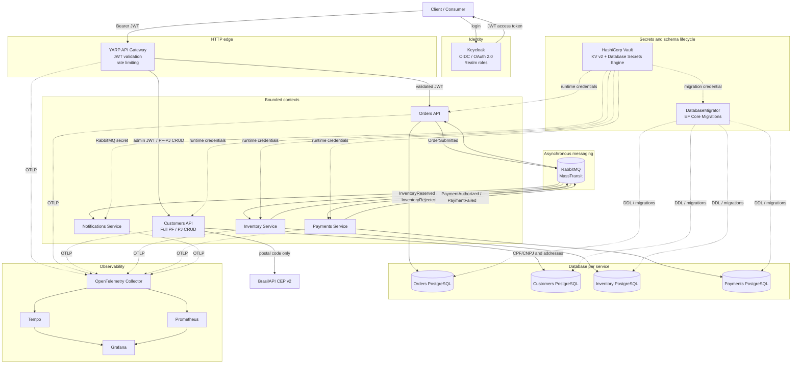
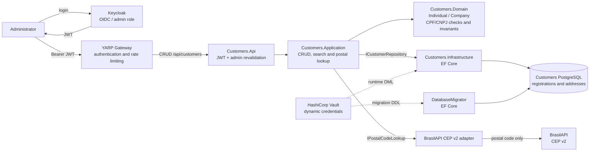
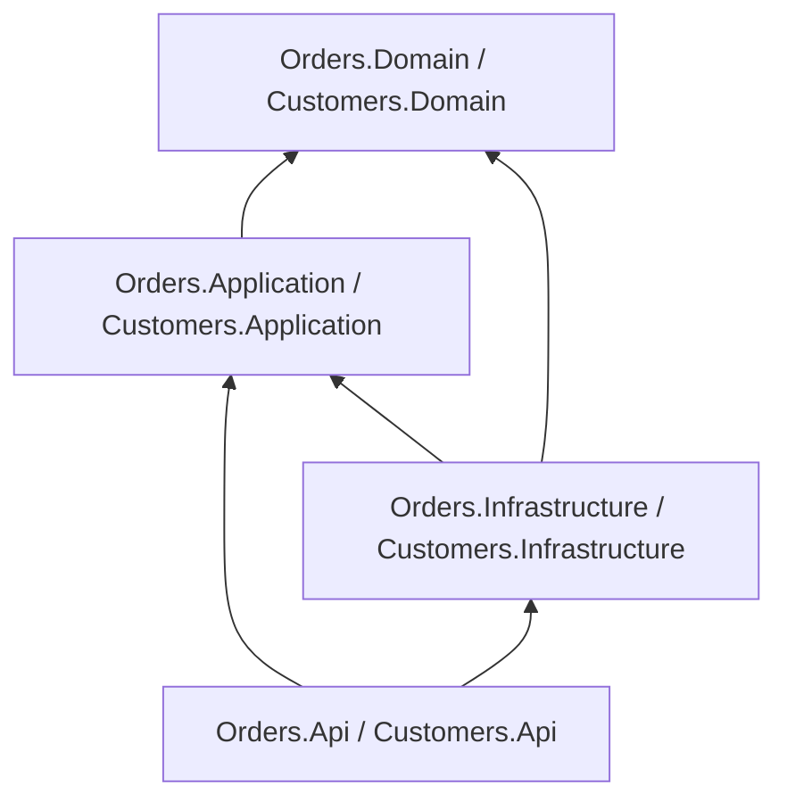

[🇧🇷 Português](architecture.md)

# Architecture

## System goal

Distributed Commerce Platform is a reference architecture for a transactional checkout journey **and administrative individual/company registration** implemented with independently deployable .NET services.

It is deliberately designed around architectural concerns that become important at senior/lead level:

- service boundaries;
- state ownership;
- asynchronous communication;
- delivery guarantees;
- transactional messaging;
- idempotency;
- eventual consistency;
- failure handling;
- observability;
- deployment independence.

## Context diagram



The synchronous checkout path ends at Orders. Administrative registration follows an independent Gateway → Customers path; checkout collaboration between bounded contexts remains asynchronous through RabbitMQ.


## Individual and company registration flow

Registration is **synchronous over HTTP**, independent of the asynchronous order workflow. An administrator authenticates with Keycloak and calls `/api/customers` via YARP; **both the Gateway and Customers.Api validate JWTs**, and every operation, including postal-code lookup, requires the `admin` role.



**Rules and boundaries:** `Individual` uses CPF and `Company` uses CNPJ; both hold contact information and **1–10 addresses, exactly one primary**. Document check digits are validated locally and a unique index prevents duplicates. Only the eight-digit postal code is sent outside the platform; the provider may return street, city, state, IBGE, and optional coordinates. Lookup **does not persist** the suggested address. Updates replace the address collection; `isActive: false` deactivates a registration, whereas `DELETE` physically removes it.

Personal data stays in the dedicated Customers PostgreSQL database, secured with separate runtime and migration credentials. Registrations are not automatically associated with Orders' `sub` claim and do not provision a Keycloak user. For HTTP contracts and examples, see the [main README](../README.en.md#individualcompany-registry-and-addresses), [API endpoints](../src/Services/Customers/Customers.Api/CustomerEndpoints.cs), [ADR-0013](adr/0013-customers-pf-pj-brasilapi-cep.en.md), and [PF/PJ smoke script](../scripts/customers-smoke.sh).

## Boundaries

### Keycloak

Keycloak is the platform OpenID Connect/OAuth 2.0 Identity Provider. It authenticates users, issues JWT access tokens and publishes realm roles used by authorization policies.

Keycloak is an identity platform component rather than a business bounded context.

### YARP API Gateway

The Gateway is the public HTTP ingress. It validates JWTs at the edge, applies identity-partitioned rate limiting and forwards authenticated calls to Orders or Customers.

The Gateway is not the only security boundary: Orders and Customers validate the JWT again.

### Orders

Orders owns the customer-facing order aggregate and is the only service that can change order lifecycle state.

It exposes synchronous HTTP commands/queries but collaborates with other bounded contexts through integration events.

### Customers

Customers is the admin-only bounded context for individual/company registration. It owns a dedicated PostgreSQL database, validates CPF/CNPJ locally, stores contacts and up to ten addresses with exactly one primary address.

Registration operations require the `admin` role. Postal-code lookup uses BrasilAPI v2 through the application port `IPostalCodeLookup`, keeping the domain provider-agnostic. CPF/CNPJ values are never sent to BrasilAPI.

### Inventory

Inventory owns reservation decisions.

It does not modify Orders data or call the Orders database. It communicates through events.

### Payments

Payments owns payment decisions.

The demo uses a deterministic rule rather than a real payment gateway so the architecture can run without credentials.

### Notifications

Notifications reacts to completed payment outcomes without becoming part of the critical transaction chain.

This demonstrates how additional capabilities can subscribe to business events without increasing coupling between core services.

## Clean Architecture dependency direction



The Orders and Customers core domains have no reference to:

- EF Core;
- MassTransit;
- RabbitMQ;
- ASP.NET Core;
- PostgreSQL.

## Messaging topology

Integration contracts live in a small shared contracts assembly.

The shared assembly contains message schemas only. It contains no service implementation or shared database model.

Current events:

- `OrderSubmitted`
- `InventoryReserved`
- `InventoryRejected`
- `PaymentAuthorized`
- `PaymentFailed`

## Transaction boundary

Orders uses MassTransit Bus Outbox with EF Core.

```text
HTTP Request
   |
   +--> create Order aggregate
   |
   +--> publish OrderSubmitted
   |
   +--> SaveChanges()
           |
           +--> order row
           +--> outbox row
```

The broker publish happens after the database transaction is safely committed.

This avoids a two-phase distributed transaction while preserving reliable delivery.

## Consumer reliability

Stateful consumers use MassTransit EF Core inbox/outbox support together with unique business keys.

Two levels of duplicate protection exist:

1. transport/message-level inbox semantics;
2. domain-level unique `OrderId` decision records.

This is important because idempotency should not depend only on the transport implementation.

## Consistency model

The platform is eventually consistent.

Immediately after `POST /orders`, an order is `Pending`.

Later messages move it to one terminal state:

- `Completed`;
- `InventoryRejected`;
- `PaymentFailed`.

No distributed lock or cross-service SQL transaction is used.

## Failure behavior

Receive endpoints use interval-based retry.

After retry exhaustion, MassTransit moves poison messages to its error transport, isolating repeated failures from the normal queue.

The design favors:

- at-least-once delivery;
- idempotent handling;
- observable failures;
- replayability.

## Identity and authorization

Keycloak acts as the OpenID Connect/OAuth 2.0 Identity Provider. The authenticated HTTP path is:

```text
Client
  |
  +--> Keycloak
  |      |
  |      +--> JWT access token
  |
  +--> YARP API Gateway
           |
           | issuer / audience / signature / lifetime
           | subject-partitioned rate limiting
           v
        Orders API
           |
           | validates JWT again
           | CustomerId = sub claim
           | realm roles -> policies
           | resource ownership
           v
        use case
```

JWT validation intentionally happens at both the Gateway and the destination service (**Orders or Customers**). This defense-in-depth model prevents the service from implicitly trusting the proxy. Customers additionally requires the `admin` role on every route; the `sub` claim is used for Orders authorization rather than automatic identity matching for individual/company registrations.

Business identity comes from the `sub` claim; `CustomerId` is not trusted from the request payload. Realm roles drive RBAC, while order reads enforce object-level authorization. Only the admin role has an explicit ownership bypass.

The local realm is versioned/importable so authentication and authorization remain reproducible across Aspire, Docker Compose and CI. The local password grant is only a development fixture; interactive production clients should use Authorization Code + PKCE.

See [ADR-0004](adr/0004-identity-keycloak.en.md).

## HTTP hardening and pentest readiness

The HTTP edge, Orders and Customers share a security baseline through `ServiceDefaults`:

- Kestrel `Server` header disabled;
- 1 MiB body limit;
- request-line/header bounds;
- request-header timeout;
- HSTS outside Development;
- `nosniff`, frame denial, CSP and Permissions Policy;
- TRACE/CONNECT rejected;
- authenticated responses marked `no-store`.

Orders and Customers use strict JSON handling: unmapped properties are rejected, depth is bounded and business collections/numeric values have explicit limits.

For BOLA, customer reads are not implemented as a global `GetById` followed by an in-memory comparison. PostgreSQL queries are scoped by:

```text
OrderId + CustomerId
```

Admin retains an explicit cross-customer path. A customer querying another customer's order receives `404`, avoiding resource-existence disclosure.

The delivery pipeline adds static security invariants, adversarial HTTP/JWT smoke tests, CodeQL, Gitleaks, Trivy vulnerability/secret/IaC scanning, authenticated OWASP ZAP API DAST and SBOM generation.

See [security posture](security-posture.en.md).

## Secrets management

The secure profile uses two Vault mechanisms. KV v2 stores the remaining static demo secrets, while the Database Secrets Engine issues dynamic PostgreSQL credentials for Orders, Customers, Inventory and Payments.

Each workload receives an independent file-mounted token. For database access, the token can only read `database/creds/<service>-app` and renew leases under the same prefix. Vault returns `username`, `password`, `lease_id`, TTL and `renewable`; the connection string is built only in memory.

### Stable roles and ephemeral logins

Each database has a stable `NOLOGIN` role (`orders_runtime`, `customers_runtime`, `inventory_runtime`, `payments_runtime`). Vault creates an ephemeral login and grants membership only in that role. PostgreSQL sessions switch role through connection options, separating temporary identity from persistent authorization.

The lease is renewed in the background. Renewal failure terminates the host so the orchestrator can force a new authentication and credential cycle.

Locally, the root token exists only to bootstrap Vault in dev mode. Production should prefer platform authentication such as Kubernetes Auth, with short-lived tokens, TLS, auditing and rotation. AppRole is a fallback when native platform identity is unavailable.

Service collaboration remains asynchronous through RabbitMQ; no synchronous service-to-service HTTP calls were introduced just to demonstrate OAuth. PostgreSQL credential lifecycle is detailed in [ADR-0007](adr/0007-dynamic-postgresql-credentials.en.md). This preserves the existing architectural boundaries.

## Local development orchestration with Aspire

The AppHost under `src/Platform/DistributedCommerce.AppHost` models the local topology without changing system boundaries.

```text
Aspire AppHost
├── Infrastructure containers
│   ├── Keycloak
│   ├── Vault
│   ├── vault-init
│   ├── RabbitMQ
│   ├── Orders PostgreSQL
│   ├── Customers PostgreSQL
│   ├── Inventory PostgreSQL
│   └── Payments PostgreSQL
│
└── Local .NET projects
    ├── DatabaseMigrator (one-shot)
    ├── YARP API Gateway
    ├── Orders API
    ├── Customers API
    ├── Inventory
    ├── Payments
    └── Notifications
```

Running .NET workloads as local projects improves the inner loop through breakpoints, incremental builds, per-resource logs and Aspire Dashboard telemetry. External dependencies remain containerized.

The simplification is operational only. The AppHost preserves:

- Keycloak authentication;
- the Keycloak → YARP → Orders/Customers flows with double JWT validation;
- RabbitMQ;
- Vault KV v2;
- Vault Database Secrets Engine;
- temporary PostgreSQL workload identities;
- lease renewal and fail-closed behavior;
- database-per-service ownership.

Secure Docker Compose remains the CI-tested parity model and the alternative for a fully containerized run. The Aspire AppHost is a development tool, not the production deployment architecture.

See [ADR-0008](adr/0008-dotnet-aspire-local-orchestration.en.md) and the [local-development guide](local-development.en.md).

## Observability

A shared OpenTelemetry building block exposes:

- an `ActivitySource` for custom spans;
- a `Meter` for custom counters;
- message-processing metrics;
- OTLP export when configured.

The local profile includes OpenTelemetry Collector, Grafana Tempo, Prometheus and Grafana. The application code remains backend-agnostic so telemetry backends can change without coupling services to a vendor.

## Deployment model

Every service has its own Dockerfile and health endpoint.

The Kubernetes examples assume:

- independent replicas;
- service-level resource limits;
- readiness/liveness checks;
- secrets supplied outside source control;
- managed/external RabbitMQ and PostgreSQL in production.

## Intentional omissions

For portfolio clarity, the first version intentionally does not include:

- a frontend;
- a real payment provider;
- service mesh;
- Event Sourcing;
- a Kubernetes operator stack.

These can be added later, but are not required to demonstrate the distributed consistency and messaging concerns at the center of the project.


## Service Defaults, HTTP resilience and edge protection

All workloads use the `src/BuildingBlocks/ServiceDefaults` building block.

It centralizes:

- OpenTelemetry;
- readiness at `/health`;
- liveness at `/alive`;
- service discovery;
- the Standard Resilience Handler for `HttpClient`.

The goal is to prevent new services from being created without the platform's minimum operational baseline.

The Gateway adds identity-partitioned token-bucket rate limiting. This is an edge control and does not replace business authorization inside services.

Orders exposes OpenAPI only in Development, and the Aspire topology test verifies the document.

See [ADR-0009](adr/0009-service-defaults-api-resilience.en.md).

## Software supply chain and runtime hardening

Delivery controls are layered:

```text
source
  |
  +--> CodeQL
  +--> Trivy
  +--> SBOM
  +--> OpenSSF Scorecard
  |
  v
commit-pinned GitHub Actions
  |
  v
image builds
  |
  v
non-root .NET containers
  |
  v
v* tag
  |
  v
GHCR + provenance attestation
```

.NET images run with the non-root user provided by the official runtime image. Under Vault-enabled Compose, token files are delivered with numeric ownership compatible with the workload user.

Kubernetes examples use:

- `runAsNonRoot: true`;
- `seccompProfile: RuntimeDefault`;
- `allowPrivilegeEscalation: false`;
- all Linux capabilities dropped;
- readiness at `/health`;
- liveness at `/alive`.

See [ADR-0010](adr/0010-software-supply-chain.en.md).


## Schema lifecycle and migration identity

Application runtime does not create or migrate database schema.

```text
PostgreSQL
   |
   +--> <service>_migrator (NOLOGIN, DDL)
   |        ^
   |        |
   |     Vault <service>-migration
   |        ^
   |        |
   |  one-shot DatabaseMigrator
   |
   +--> <service>_runtime (NOLOGIN, DML)
            ^
            |
         Vault <service>-app
            ^
            |
        application
```

EF Core Migrations are committed per bounded context. `DatabaseMigrator` runs before Orders, Inventory and Payments in Compose/Aspire; the GitOps model runs it as an Argo CD `PreSync` Job.

Default privileges grant runtime DML on migration-created objects without giving application runtime DDL.

See [ADR-0011](adr/0011-ef-migrations-vault-deployment-identity.en.md).

## Executable guardrails

Three additional layers protect architecture:

- `Architecture.Tests` blocks forbidden dependencies;
- `Contracts.Compatibility.Tests` guards integration-event shapes;
- `Chaos.Tests` validates PostgreSQL connectivity failure and recovery with Testcontainers + Toxiproxy.

These tests execute through the normal CI `dotnet test`.

## GitOps and progressive delivery

The production example under `deploy/gitops` separates:

```text
build artifact
    |
    v
versioned OCI image + attestation
    |
    v
promotion PR
    |
    v
main
    |
    v
Argo CD reconciliation
    |
    +--> PreSync database migration
    |
    v
Argo Rollouts canary
20% -> health analysis -> 50% -> health analysis -> 100%
```

Runtime and migration use separate Kubernetes ServiceAccounts and Vault Kubernetes Auth roles.

Canary analysis targets `orders-api-canary/health/deployment`. Without a dedicated traffic router, this example uses replica-based approximate weights; environments requiring exact traffic percentages should integrate a supported ingress/service mesh.

See [ADR-0012](adr/0012-architecture-contract-chaos-gitops.en.md) and [deploy/gitops](../deploy/gitops/README.en.md).
