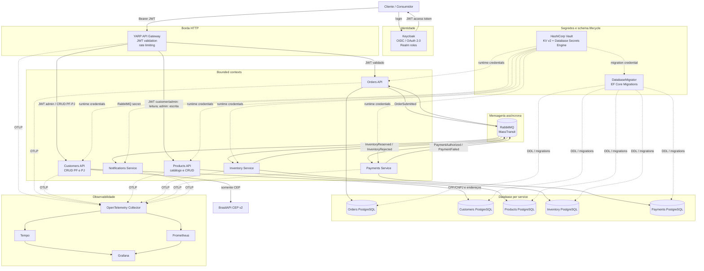
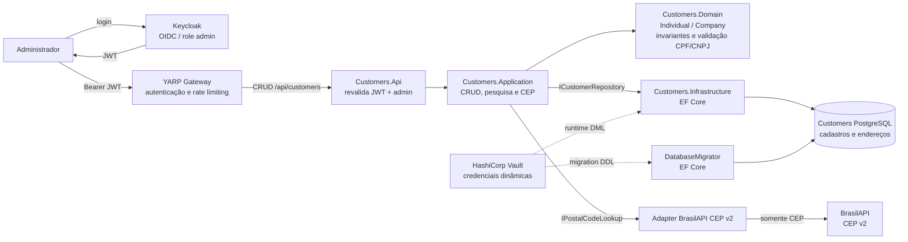
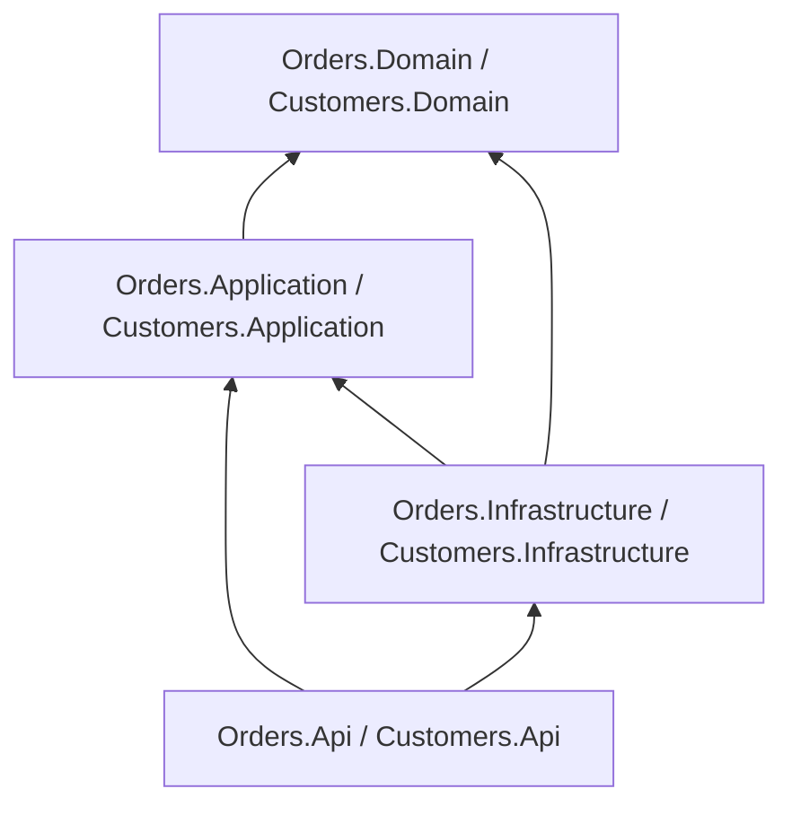

[🇺🇸 English](architecture.en.md)

# Arquitetura

## Objetivo do sistema

O Distributed Commerce Platform é uma arquitetura de referência para uma jornada transacional de checkout **e para cadastro administrativo de pessoas físicas e jurídicas** implementada com serviços .NET implantáveis de forma independente.

O projeto foi desenhado intencionalmente em torno de preocupações arquiteturais relevantes em nível sênior/lead:

- limites entre serviços;
- ownership de estado;
- comunicação assíncrona;
- garantias de entrega;
- mensageria transacional;
- idempotência;
- consistência eventual;
- tratamento de falhas;
- observabilidade;
- independência de deployment.

## Diagrama de contexto



O caminho síncrono do checkout termina em Orders. O cadastro administrativo segue um caminho independente Gateway → Customers; a colaboração do checkout entre bounded contexts continua assíncrona por RabbitMQ.


## Fluxo do cadastro de pessoas PF e PJ

O caminho de cadastro é **HTTP síncrono**, independente da orquestração assíncrona de pedidos. O administrador autentica-se no Keycloak e acessa as rotas `/api/customers` por meio do YARP; **Gateway e Customers.Api validam JWT**, e todas as operações, inclusive a consulta de CEP, exigem a role `admin`.



**Regras e limites:** `Individual` usa CPF e `Company` usa CNPJ; ambos possuem dados de contato e de **1 a 10 endereços, exatamente um principal**. O documento é validado localmente por dígito verificador e possui índice único. A consulta externa usa apenas o CEP de oito dígitos e pode retornar logradouro, cidade, UF, IBGE e coordenadas opcionais; ela **não persiste** endereço por conta própria. Os comandos de atualização substituem a coleção de endereços; `isActive: false` inativa o cadastro, enquanto `DELETE` o remove fisicamente.

Os dados pessoais permanecem no PostgreSQL de Customers, protegido por credenciais de runtime distintas da identidade de migração. O agregado de cadastro não é vinculado automaticamente à claim `sub` dos pedidos de Orders, nem provisiona usuário no Keycloak. Para contratos HTTP e exemplos, veja o [README principal](../README.md#cadastro-pfpj-e-endereços), os [endpoints da API](../src/Services/Customers/Customers.Api/CustomerEndpoints.cs), a [ADR-0013](adr/0013-customers-pf-pj-brasilapi-cep.md) e o [smoke de PF/PJ](../scripts/customers-smoke.sh).

## Limites

### Keycloak

Keycloak é o Identity Provider OpenID Connect/OAuth 2.0 da plataforma. Ele autentica usuários, emite access tokens JWT e publica realm roles utilizadas pelas policies de autorização.

Keycloak é um componente de identidade da plataforma, não um bounded context de negócio.

### YARP API Gateway

O Gateway é a entrada HTTP pública. Ele valida JWT na borda, aplica rate limiting por identidade e encaminha chamadas autenticadas para Orders ou Customers.

O Gateway não é a única barreira de segurança: Orders e Customers validam o JWT novamente.

### Orders

Orders é responsável pelo agregado de pedido voltado ao cliente e é o único serviço que pode alterar o estado do ciclo de vida do pedido.

Ele expõe comandos/consultas HTTP síncronos, mas colabora com outros bounded contexts por meio de eventos de integração.

### Customers

Customers é o bounded context administrativo para cadastro de pessoas físicas e jurídicas. Ele possui PostgreSQL próprio, valida CPF/CNPJ localmente, mantém contatos e até dez endereços por pessoa, com exatamente um endereço principal.

As operações de cadastro exigem role `admin`. A consulta de CEP usa BrasilAPI v2 por uma porta de aplicação (`IPostalCodeLookup`), mantendo o domínio independente do provedor. CPF/CNPJ nunca são enviados à BrasilAPI.

### Products

Products é o bounded context de catálogo com SKU e código de barras únicos, nome, descrição, categoria, marca, unidade, preço BRL e status. GET exige JWT com role `customer` ou `admin`; POST/PUT/DELETE exigem `admin`. O serviço possui PostgreSQL próprio e credenciais Vault dinâmicas separadas para runtime e migration. Não mantém saldo físico nem faz reserva de estoque — responsabilidades de Inventory. Veja [ADR-0014](adr/0014-products-catalog-crud.md).

### Inventory

Inventory é responsável pelas decisões de reserva.

Ele não altera dados de Orders nem acessa o banco de Orders. A comunicação acontece por eventos.

### Payments

Payments é responsável pelas decisões de pagamento.

A demonstração usa uma regra determinística em vez de um gateway real, permitindo executar a arquitetura sem credenciais externas.

### Notifications

Notifications reage aos resultados de pagamento concluídos sem fazer parte da cadeia transacional crítica.

Isso demonstra como novas capacidades podem assinar eventos de negócio sem aumentar o acoplamento entre os serviços centrais.

## Direção de dependências na Clean Architecture



Os domínios centrais de Orders e Customers não referenciam:

- EF Core;
- MassTransit;
- RabbitMQ;
- ASP.NET Core;
- PostgreSQL.

## Topologia de mensageria

Os contratos de integração ficam em um assembly compartilhado pequeno.

Esse assembly contém apenas schemas de mensagens. Ele não contém implementação de serviços nem modelo compartilhado de banco de dados.

Eventos atuais:

- `OrderSubmitted`
- `InventoryReserved`
- `InventoryRejected`
- `PaymentAuthorized`
- `PaymentFailed`

## Limite transacional

Orders usa o Bus Outbox do MassTransit com EF Core.

```text
HTTP Request
   |
   +--> cria o agregado Order
   |
   +--> publica OrderSubmitted
   |
   +--> SaveChanges()
           |
           +--> linha do pedido
           +--> linha da outbox
```

A publicação no broker acontece após o commit seguro da transação no banco de dados.

Isso evita uma transação distribuída em duas fases sem abrir mão da entrega confiável.

## Confiabilidade dos consumers

Consumers com estado usam suporte inbox/outbox do MassTransit com EF Core em conjunto com chaves de negócio únicas.

Existem dois níveis de proteção contra duplicidade:

1. semântica de inbox no nível de transporte/mensagem;
2. registros únicos de decisão por `OrderId` no nível de domínio.

Isso é importante porque a idempotência não deve depender somente da implementação de transporte.

## Modelo de consistência

A plataforma é eventualmente consistente.

Logo após `POST /orders`, um pedido está em `Pending`.

Mensagens posteriores movem o pedido para um estado terminal:

- `Completed`;
- `InventoryRejected`;
- `PaymentFailed`.

Não há lock distribuído nem transação SQL entre serviços.

## Comportamento de falhas

Os receive endpoints usam retry baseado em intervalo.

Após esgotar as tentativas, o MassTransit move mensagens problemáticas para o transporte de erro, isolando falhas repetidas da fila normal.

O design prioriza:

- entrega at-least-once;
- processamento idempotente;
- falhas observáveis;
- possibilidade de replay.

## Identidade e autorização

Keycloak atua como Identity Provider OpenID Connect/OAuth 2.0. O fluxo HTTP autenticado é:

```text
Cliente
  |
  +--> Keycloak
  |      |
  |      +--> access token JWT
  |
  +--> YARP API Gateway
           |
           | issuer / audience / signature / lifetime
           | rate limiting por sub
           v
        Orders API
           |
           | valida JWT novamente
           | CustomerId = claim sub
           | realm roles -> policies
           | ownership do recurso
           v
        caso de uso
```

A validação acontece em duas camadas de propósito: Gateway e o serviço de destino (**Orders ou Customers**). Isso fornece defesa em profundidade e evita que o serviço confie implicitamente no proxy. Customers também exige a role `admin` em todas as rotas; a claim `sub` é usada para autorização de pedidos em Orders, não como chave automática do cadastro de pessoas.

A identidade de negócio é derivada da claim `sub`; `CustomerId` não é aceito como autoridade no payload. Realm roles alimentam RBAC, e consultas de pedido verificam object-level authorization. Apenas a role administrativa possui bypass explícito de ownership.

O realm local é versionado e importável, deixando autenticação/autorização reproduzíveis em Aspire, Docker Compose e CI. O password grant usado pelo smoke local é somente fixture de desenvolvimento; clientes interativos de produção devem usar Authorization Code + PKCE.

Veja [ADR-0004](adr/0004-identity-keycloak.md).

## Hardening HTTP e pentest readiness

A borda HTTP, Orders e Customers compartilham um baseline de segurança no `ServiceDefaults`:

- Kestrel sem header `Server`;
- body máximo de 1 MiB;
- limites de request line e headers;
- timeout de request headers;
- HSTS fora de Development;
- `nosniff`, `DENY`, CSP e Permissions Policy;
- TRACE/CONNECT bloqueados;
- responses autenticadas com `Cache-Control: no-store`.

Orders usa JSON estrito: propriedades não mapeadas são rejeitadas, profundidade é limitada e coleções/números de negócio possuem limites explícitos.

Para BOLA, a leitura de customer não faz `GetById` global seguido de comparação em memória. A query é escopada no banco por:

```text
OrderId + CustomerId
```

Admin mantém um caminho explícito transversal. Um customer consultando um pedido de outro customer recebe `404`, evitando resource-existence disclosure.

Além dos testes funcionais, o pipeline executa:

- security invariants;
- smoke adversarial HTTP/JWT;
- CodeQL;
- Gitleaks;
- Trivy vulnerability/secret/IaC;
- OWASP ZAP API Scan autenticado;
- SBOM.

Veja [postura de segurança](security-posture.md).

## Gestão de segredos

O perfil seguro usa HashiCorp Vault com dois mecanismos. KV v2 armazena os segredos estáticos restantes do demo, enquanto o Database Secrets Engine emite credenciais PostgreSQL dinâmicas para Orders, Customers, Inventory e Payments.

Cada workload recebe um token independente por arquivo montado. Para banco, o token só pode ler `database/creds/<service>-app` e renovar leases sob o mesmo prefixo. A resposta do Vault fornece `username`, `password`, `lease_id`, TTL e `renewable`; o connection string é construído somente em memória.

### Roles estáveis e logins efêmeros

Cada banco possui uma role `NOLOGIN` estável (`orders_runtime`, `customers_runtime`, `inventory_runtime`, `payments_runtime`). O Vault cria um login efêmero e concede membership somente nessa role. A sessão PostgreSQL faz `SET ROLE` via connection options, separando a identidade temporária da autorização persistente.

O lease é renovado em background. Se a renovação falhar, o host encerra o processo para que o orquestrador force uma nova autenticação e uma nova credencial.

No ambiente local, o root token existe apenas para bootstrap do Vault em modo dev. Em produção, a preferência é autenticação de plataforma, como Kubernetes Auth, com tokens curtos, TLS, auditoria e rotação. AppRole é tratado como fallback quando identidade nativa da plataforma não está disponível.

A comunicação entre serviços continua assíncrona por RabbitMQ; não foram introduzidas chamadas HTTP service-to-service apenas para demonstrar OAuth. O lifecycle das credenciais PostgreSQL está detalhado no [ADR-0007](adr/0007-dynamic-postgresql-credentials.md). Isso preserva os limites arquiteturais já existentes.

## Orquestração de desenvolvimento local com Aspire

O AppHost em `src/Platform/DistributedCommerce.AppHost` modela a topologia local sem alterar os limites arquiteturais do sistema.

```text
Aspire AppHost
├── Infrastructure containers
│   ├── Keycloak
│   ├── Vault
│   ├── vault-init
│   ├── RabbitMQ
│   ├── Orders PostgreSQL
│   ├── Customers PostgreSQL
│   ├── Inventory PostgreSQL
│   └── Payments PostgreSQL
│
└── Local .NET projects
    ├── DatabaseMigrator (one-shot)
    ├── YARP API Gateway
    ├── Orders API
    ├── Customers API
    ├── Inventory
    ├── Payments
    └── Notifications
```

A escolha de executar os workloads .NET como projetos locais melhora o inner loop: breakpoints, recompilação incremental, logs por recurso e telemetria aparecem no Aspire Dashboard. Dependências externas continuam containerizadas.

A simplificação é somente operacional. O AppHost preserva:

- autenticação Keycloak;
- fluxo Keycloak → YARP → Orders com dupla validação JWT;
- RabbitMQ;
- Vault KV v2;
- Vault Database Secrets Engine;
- login PostgreSQL temporário por workload;
- lease renewal e fail closed;
- database-per-service.

O Docker Compose seguro continua sendo o modelo de paridade usado pelo CI e a alternativa para executar toda a aplicação em containers. O Aspire AppHost é uma ferramenta de desenvolvimento, não a definição da arquitetura de implantação em produção.

Veja [ADR-0008](adr/0008-dotnet-aspire-local-orchestration.md) e o [guia de desenvolvimento local](local-development.md).

## Observabilidade

Um building block compartilhado de OpenTelemetry expõe:

- `ActivitySource` para spans customizados;
- `Meter` para contadores customizados;
- métricas de processamento de mensagens;
- exportação OTLP quando configurada.

O perfil local inclui OpenTelemetry Collector, Grafana Tempo, Prometheus e Grafana. O código continua backend-agnostic: trocar o backend não exige acoplar os serviços a um fornecedor.

## Modelo de deployment

Cada serviço possui seu próprio Dockerfile e health endpoint.

Os exemplos de Kubernetes assumem:

- réplicas independentes;
- limites de recursos por serviço;
- checks de readiness/liveness;
- segredos fornecidos fora do controle de versão;
- RabbitMQ e PostgreSQL gerenciados/externos em produção.

## Omissões intencionais

Para manter clareza de portfólio, a primeira versão intencionalmente não inclui:

- frontend;
- provedor real de pagamentos;
- service mesh;
- Event Sourcing;
- stack de operadores Kubernetes.

Esses itens podem ser adicionados no futuro, mas não são necessários para demonstrar as preocupações de consistência distribuída e mensageria que estão no centro do projeto.


## Service Defaults, resiliência HTTP e proteção de borda

Todos os workloads usam o building block `src/BuildingBlocks/ServiceDefaults`.

Ele centraliza:

- OpenTelemetry;
- readiness em `/health`;
- liveness em `/alive`;
- service discovery;
- Standard Resilience Handler para `HttpClient`.

O objetivo é evitar que um novo serviço nasça sem os padrões operacionais mínimos.

O Gateway adiciona token-bucket rate limiting particionado por identidade autenticada. Esse controle é de borda e não substitui autorização de negócio dentro dos serviços.

Orders expõe OpenAPI somente em Development. O documento é verificado pelo teste de topologia Aspire.

Veja [ADR-0009](adr/0009-service-defaults-api-resilience.md).

## Software supply chain e runtime hardening

A cadeia de entrega aplica controles em diferentes camadas:

```text
source
  |
  +--> CodeQL
  +--> Trivy
  +--> SBOM
  +--> OpenSSF Scorecard
  |
  v
GitHub Actions pinadas por SHA
  |
  v
build de imagens
  |
  v
containers .NET non-root
  |
  v
tag v*
  |
  v
GHCR + provenance attestation
```

As imagens .NET são executadas com o usuário non-root fornecido pelas imagens oficiais. No Compose com Vault, os token files são entregues com ownership numérico compatível com o workload.

Os manifests Kubernetes usam:

- `runAsNonRoot: true`;
- `seccompProfile: RuntimeDefault`;
- `allowPrivilegeEscalation: false`;
- drop de todas as capabilities Linux;
- readiness em `/health`;
- liveness em `/alive`.

Veja [ADR-0010](adr/0010-software-supply-chain.md).


## Schema lifecycle e identidade de migration

A aplicação não possui responsabilidade de criar ou migrar schema.

```text
PostgreSQL
   |
   +--> <service>_migrator (NOLOGIN, DDL)
   |        ^
   |        |
   |     Vault <service>-migration
   |        ^
   |        |
   |  DatabaseMigrator one-shot
   |
   +--> <service>_runtime (NOLOGIN, DML)
            ^
            |
         Vault <service>-app
            ^
            |
        application
```

EF Core Migrations são versionadas por bounded context. O `DatabaseMigrator` executa antes de Orders, Inventory e Payments em Compose/Aspire; no modelo GitOps ele é um Argo CD `PreSync` Job.

Default privileges garantem que objetos criados pela role migrator concedam DML ao runtime sem entregar DDL à aplicação.

Veja [ADR-0011](adr/0011-ef-migrations-vault-deployment-identity.md).

## Guardrails executáveis

A arquitetura é protegida por três camadas adicionais:

- `Architecture.Tests` bloqueia dependências proibidas;
- `Contracts.Compatibility.Tests` protege o shape dos integration events;
- `Chaos.Tests` valida falha e recuperação de conectividade PostgreSQL com Testcontainers + Toxiproxy.

Esses testes executam no mesmo `dotnet test` do CI.

## GitOps e progressive delivery

O exemplo de produção em `deploy/gitops` separa:

```text
build artifact
    |
    v
versioned OCI image + attestation
    |
    v
promotion PR
    |
    v
main
    |
    v
Argo CD reconciliation
    |
    +--> PreSync database migration
    |
    v
Argo Rollouts canary
20% -> health analysis -> 50% -> health analysis -> 100%
```

Runtime e migrator usam Kubernetes ServiceAccounts e Vault Kubernetes Auth roles diferentes.

O canary consulta especificamente `orders-api-canary/health/deployment`. Sem traffic router dedicado, o exemplo usa distribuição aproximada por réplicas; um ambiente que exija pesos exatos deve adicionar um ingress/service mesh suportado, não um componente apenas decorativo.

Veja [ADR-0012](adr/0012-architecture-contract-chaos-gitops.md) e [deploy/gitops](../deploy/gitops/README.md).
