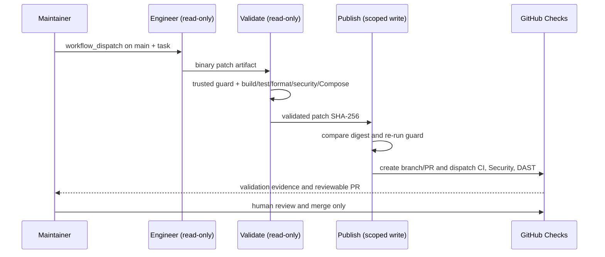

[🇧🇷 Português](technical-walkthrough.md)

# Platform Technical Walkthrough

This page is a **5-minute technical inspection guide** for engineers, architects, maintainers and anyone who needs to understand or evolve the repository.

The goal is to make engineering decisions, evidence and guardrails easy to understand without reading the entire codebase.

## 1. Identity, edge and service boundaries

Start with the high-level path:

- [Architecture overview](./architecture.en.md)
- [Security building block](../src/BuildingBlocks/Security/KeycloakAuthenticationExtensions.cs)
- [Versioned Keycloak realm](../deploy/keycloak/distributed-commerce-realm.json)
- [YARP Gateway](../src/Gateway/ApiGateway/Program.cs)
- [Integration event contracts](../src/BuildingBlocks/Contracts/IntegrationEvents.cs)

Ingress flow (separate checkout and administrative registration paths):

```text
User / Administrator
         |
         v
      Keycloak (JWT and roles)
         |
         v
   YARP API Gateway
   (JWT validation and rate limiting)
         |
         +----> Orders API: JWT + ownership --> Checkout / RabbitMQ
         |
         +----> Customers API: JWT + admin role --> PF/PJ CRUD
                                                     |
                                        Customers PostgreSQL
                                                     |
                              Optional CEP lookup --> BrasilAPI v2
```
After the HTTP command, collaboration between the four business services remains asynchronous:

- Orders
- Inventory
- Payments
- Notifications

Stateful services own separate PostgreSQL databases and do not read another bounded context's tables.

The important distinction is that **Keycloak and YARP are identity/edge platform components**, while Customers, Orders, Inventory, Payments and Notifications are business bounded contexts. Customers handles administration separately from the asynchronous checkout flow.


## 2. Clean Architecture

The Orders bounded context is intentionally structured into:

```text
Orders.Domain
      ↑
Orders.Application
      ↑
Orders.Infrastructure
      ↑
Orders.Api
```

Useful files:

- [Order aggregate](../src/Services/Orders/Orders.Domain/Order.cs)
- [Application ports](../src/Services/Orders/Orders.Application/Abstractions.cs)
- [Application use case](../src/Services/Orders/Orders.Application/OrderService.cs)
- [Infrastructure composition](../src/Services/Orders/Orders.Infrastructure/DependencyInjection.cs)

The domain layer has no dependency on ASP.NET Core, EF Core, RabbitMQ or MassTransit.

## 3. RabbitMQ and event-driven collaboration

The complete flow starts authenticated at the edge, then switches to asynchronous collaboration:

```text
Keycloak -> YARP -> POST /orders
                      |
                      v
                 OrderSubmitted
                      |
                      v
                  Inventory
                      |
          InventoryReserved / Rejected
                      |
                      v
                   Payments
                      |
          PaymentAuthorized / Failed
                      |
                      v
             Orders + Notifications
```

Useful files:

- [Keycloak security setup](../src/BuildingBlocks/Security/KeycloakAuthenticationExtensions.cs)
- [YARP Gateway](../src/Gateway/ApiGateway/Program.cs)
- [Orders API and MassTransit setup](../src/Services/Orders/Orders.Api/Program.cs)
- [Inventory consumer](../src/Services/Inventory/Inventory.Service/OrderSubmittedConsumer.cs)
- [Payment consumer](../src/Services/Payments/Payments.Service/InventoryReservedConsumer.cs)
- [Notification consumers](../src/Services/Notifications/Notifications.Service/PaymentConsumers.cs)


## 4. Reliability: Outbox, Inbox and idempotency

The repository intentionally addresses the distributed dual-write problem.

Orders uses MassTransit EF Core Bus Outbox so order persistence and outgoing message intent share the same persistence boundary.

Stateful consumers use inbox/outbox support and business-level duplicate protection.

Useful evidence:

- [Orders DbContext / outbox entities](../src/Services/Orders/Orders.Infrastructure/OrdersDbContext.cs)
- [Inventory DbContext / inbox-outbox](../src/Services/Inventory/Inventory.Service/InventoryDbContext.cs)
- [Payments DbContext / inbox-outbox](../src/Services/Payments/Payments.Service/PaymentsDbContext.cs)
- [ADR: Transactional Outbox](./adr/0002-transactional-outbox.en.md)
- [ADR: Idempotency and eventual consistency](./adr/0003-idempotency-eventual-consistency.en.md)

## 5. Observability

The platform uses a vendor-neutral OpenTelemetry building block.

Useful evidence:

- [Shared telemetry building block](../src/BuildingBlocks/Observability/PlatformTelemetry.cs)
- [Architecture notes on observability](./architecture.en.md#observability)

The code exposes custom spans and metrics over OTLP. The local environment includes OpenTelemetry Collector, Tempo, Prometheus and Grafana.

## 6. Testing and delivery

Useful evidence:

- [Order domain tests](../tests/Orders.Domain.Tests/OrderTests.cs)
- [Real PostgreSQL integration through Testcontainers](../tests/Orders.Persistence.IntegrationTests/OrderRepositoryTests.cs)
- [GitHub Actions CI](../.github/workflows/ci.yml)
- [Docker Compose](../docker-compose.yml)
- [Kubernetes examples](../deploy/k8s/README.en.md)

The CI pipeline validates:

- dependency restore;
- Release build;
- automated tests;
- code coverage;
- Sonar/.editorconfig/dotnet format quality gate;
- unit and Testcontainers tests;
- Gateway + four service image builds;
- Keycloak → YARP → Orders smoke test using the Vault profile;
- a real ephemeral PostgreSQL user created by Vault;
- no effective connection string in the application environment;
- actual lease renewal during CI.

## 7. Security and identity

Useful evidence:

- [Security building block](../src/BuildingBlocks/Security/KeycloakAuthenticationExtensions.cs)
- [Versioned local realm](../deploy/keycloak/distributed-commerce-realm.json)
- [Authentication/authorization smoke test](../scripts/auth-smoke.sh)
- [Identity ADR](./adr/0004-identity-keycloak.en.md)

The project demonstrates JWT validation, audience/issuer checks, RBAC and object-level authorization. CustomerId is not trusted from the payload: it comes from the authenticated `sub`.

HTTP authentication is intentionally validated at two layers:

```text
Client
  -> Keycloak
  -> YARP Gateway
  -> Orders
```

Keycloak authenticates the user and issues the JWT. YARP validates it and applies rate limiting; Orders validates issuer/audience/signature/lifetime again and enforces resource authorization.

Secrets use workload-scoped Vault tokens and policies. RabbitMQ remains in KV v2, while PostgreSQL uses dynamic credentials. Orders, Inventory and Payments receive temporary runtime logins with TTL + renewable leases, while migrations use separate short-lived Vault identities with DDL capability.

Evidence:

- [Dynamic secret loader](../src/BuildingBlocks/Secrets/VaultConfigurationExtensions.cs)
- [Lease renewal service](../src/BuildingBlocks/Secrets/VaultLeaseRenewalService.cs)
- [Database Secrets Engine bootstrap](../deploy/vault/vault-init.sh)
- [Vault overlay](../docker-compose.vault.yml)
- [ADR-0006 — secrets vault](./adr/0006-secrets-hashicorp-vault.en.md)
- [ADR-0007 — dynamic PostgreSQL credentials](./adr/0007-dynamic-postgresql-credentials.en.md)

## 8. Developer experience with .NET Aspire

The repository also makes **developer experience** and technical onboarding inspectable.

Evidence:

- [Aspire AppHost](../src/Platform/DistributedCommerce.AppHost/AppHost.cs)
- [AppHost project](../src/Platform/DistributedCommerce.AppHost/DistributedCommerce.AppHost.csproj)
- [Local-development guide](./local-development.en.md)
- [ADR-0008 — local Aspire orchestration](./adr/0008-dotnet-aspire-local-orchestration.en.md)

A contributor can start the local topology with:

```bash
dotnet run --project src/Platform/DistributedCommerce.AppHost
```

The AppHost keeps Keycloak, Vault, RabbitMQ and four PostgreSQL databases containerized while the Gateway and five .NET services run as local projects. This preserves dynamic PostgreSQL credentials and lease renewal while enabling breakpoints, per-resource logs and centralized Aspire Dashboard telemetry.

Docker Compose remains the CI-tested parity path.

### Administrative individual/company registry (Customers)

- [CRUD and CEP endpoints](../src/Services/Customers/Customers.Api/CustomerEndpoints.cs)
- [Customer aggregate and address invariants](../src/Services/Customers/Customers.Domain/Customer.cs)
- [BrasilAPI CEP v2 adapter](../src/Services/Customers/Customers.Infrastructure/BrasilApiPostalCodeLookup.cs)
- [EF Core migration and snapshot](../src/Services/Customers/Customers.Infrastructure/Migrations/CustomersDbContextModelSnapshot.cs)
- [Migration-drift regression test](../tests/Customers.Infrastructure.Tests/CustomersMigrationModelTests.cs)
- [Authenticated PF/PJ smoke script](../scripts/customers-smoke.sh)
- [ADR-0013 — PF/PJ registry and CEP](./adr/0013-customers-pf-pj-brasilapi-cep.en.md)

`/api/customers` requires an `admin` role in both Gateway and service, with a dedicated PostgreSQL database and separate dynamic runtime/migration identities. The API exposes `POST`, `GET` (list/detail), `PUT`, `DELETE`, and postal-code lookup for CPF (`Individual`) and CNPJ (`Company`) registrations, contacts and 1–10 addresses with exactly one primary. See the [registration journey diagram](./architecture.en.md#individual-and-company-registration-flow). The adapter sends **only the postal code** to BrasilAPI; CPF/CNPJ remain locally validated. CI exercises CRUD and migration-model consistency; authenticated ZAP scans both APIs.

## 9. AI engineering automation

Useful evidence:

- [AGENTS.md](../AGENTS.md)
- [Engineering constitution](../.ai/engineering-constitution.md)
- [AI Evolution Harness workflow](../.github/workflows/ai-evolution.yml)
- [Governance change guard](../scripts/ai-change-guard.py)
- [Isolated Git fixture tests](../tests/ai_harness/test_ai_change_guard.py)
- [AI-First operations guide](./ai-first-operations.en.md)
- [Harness ADR](./adr/0005-ai-engineering-harness.en.md)

**Merged implementation:** [PR #17](https://github.com/WillianZanutoOliveira/distributed-commerce-platform/pull/17), [PR #18](https://github.com/WillianZanutoOliveira/distributed-commerce-platform/pull/18), and [PR #19](https://github.com/WillianZanutoOliveira/distributed-commerce-platform/pull/19) delivered a fail-closed guard, isolated Git regression tests, the reviewed proposal, and the installed workflow on `main`.



The jobs have **separate permissions**: read-only for `engineer` and `validate`; `contents: write`, `pull-requests: write`, and `actions: write` only for `publish`. The agent cannot change `.ai/`, `.github/workflows/`, `docs/governance/`, `tests/ai_harness/`, or individual policy files; the guard checks committed, staged, unstaged, and untracked changes against an immutable trusted base SHA.

**Current status:** the workflow file is merged, and PR #19 CI and Security checks passed, but an end-to-end Codex run and automatically published PR have **not yet been confirmed**. [Issue #15](https://github.com/WillianZanutoOliveira/distributed-commerce-platform/issues/15) remains open pending the controlled test in the [operations guide](ai-first-operations.en.md).

## 10. Clean Code and DevSecOps

Useful evidence:

- [Shared rules](../.editorconfig)
- [SonarAnalyzer build integration](../Directory.Build.props)
- [Security pipeline](../.github/workflows/security.yml)
- [Code-quality guide](./code-quality.en.md)

The build treats warnings as errors and CI verifies formatting/analyzers. Security gates add CodeQL, Gitleaks, Trivy vulnerability/secret/misconfiguration scanning, SBOM generation and authenticated OWASP ZAP DAST.

## 11. Architecture decisions

The ADRs document trade-offs instead of only implementation details:

- [ADR-0001 — Event-driven services and Clean Architecture](./adr/0001-event-driven-clean-architecture.en.md)
- [ADR-0002 — Transactional Outbox](./adr/0002-transactional-outbox.en.md)
- [ADR-0003 — Idempotency and eventual consistency](./adr/0003-idempotency-eventual-consistency.en.md)
- [ADR-0004 — Identity and authorization with Keycloak](./adr/0004-identity-keycloak.en.md)
- [ADR-0005 — AI-assisted engineering harness](./adr/0005-ai-engineering-harness.en.md)
- [ADR-0006 — Centralized secrets management with HashiCorp Vault](./adr/0006-secrets-hashicorp-vault.en.md)
- [ADR-0007 — Dynamic PostgreSQL credentials with Vault Database Secrets Engine](./adr/0007-dynamic-postgresql-credentials.en.md)
- [ADR-0008 — .NET Aspire as the local development orchestrator](./adr/0008-dotnet-aspire-local-orchestration.en.md)
- [ADR-0009 — Service Defaults, health model, OpenAPI and edge protection](./adr/0009-service-defaults-api-resilience.en.md)
- [ADR-0010 — Software supply chain and attested releases](./adr/0010-software-supply-chain.en.md)
- [ADR-0011 — EF Core Migrations with a separate Vault deployment identity](./adr/0011-ef-migrations-vault-deployment-identity.en.md)
- [ADR-0012 — Architecture guardrails, contracts, fault injection and progressive delivery](./adr/0012-architecture-contract-chaos-gitops.en.md)
- [ADR-0013 — PF/PJ registry and BrasilAPI postal-code lookup](./adr/0013-customers-pf-pj-brasilapi-cep.en.md)

## What this repository is intended to demonstrate

This repository is not presented as a production system or as proof that every product should use microservices.

It is a public engineering reference designed to make the following concerns inspectable:

- architecture boundaries;
- asynchronous messaging;
- reliable event delivery;
- idempotency;
- eventual consistency;
- observability;
- containerized delivery;
- CI quality gates;
- explicit technical trade-offs.


## 12. Service Defaults, API contract and edge protection

Evidence:

- [Service Defaults](../src/BuildingBlocks/ServiceDefaults/PlatformServiceDefaults.cs)
- [Gateway rate limiting](../src/Gateway/ApiGateway/Program.cs)
- [Orders OpenAPI](../src/Services/Orders/Orders.Api/Program.cs)
- [Aspire topology test](../tests/DistributedCommerce.AppHost.Tests/LocalTopologyTests.cs)
- [ADR-0009](./adr/0009-service-defaults-api-resilience.en.md)

The project demonstrates separate readiness/liveness semantics, service discovery, resilient HTTP defaults, identity-partitioned rate limiting and a verifiable OpenAPI contract.

## 13. Software supply chain and container hardening

Evidence:

- [OpenSSF Scorecard](../.github/workflows/scorecard.yml)
- [Security pipeline](../.github/workflows/security.yml)
- [Attested OCI release workflow](../.github/workflows/release.yml)
- [CODEOWNERS](../.github/CODEOWNERS)
- [Security Policy](../SECURITY.md)
- [Kubernetes hardening](../deploy/k8s/services.yaml)
- [ADR-0010](./adr/0010-software-supply-chain.en.md)

The repository demonstrates commit-pinned GitHub Actions, CodeQL, Trivy, SBOM, OpenSSF Scorecard, non-root containers, Kubernetes security contexts and provenance attestations for published images.


## 14. Least-privilege migrations

Evidence:

- [DatabaseMigrator](../src/Platform/DatabaseMigrator/Program.cs)
- [Orders migrations](../src/Services/Orders/Orders.Infrastructure/Migrations)
- [Vault runtime/migration roles](../deploy/vault/vault-init.sh)
- [PostgreSQL role split](../deploy/postgres/orders-init.sql)
- [ADR-0011](./adr/0011-ef-migrations-vault-deployment-identity.en.md)

Technical point: application runtime has no DDL. A one-shot migrator gets a short-lived dynamic Vault credential, applies EF Migrations and exits; runtime gets only DML.

## 15. Architecture, contract and chaos testing

Evidence:

- [Architecture Tests](../tests/Architecture.Tests)
- [Contract Compatibility Tests](../tests/Contracts.Compatibility.Tests)
- [Chaos Tests](../tests/Chaos.Tests)

These gates make architecture boundaries, event compatibility and network-failure behavior executable in CI.

## 16. GitOps and canary

Evidence:

- [Argo CD Application](../deploy/gitops/argocd/orders-production.yaml)
- [Argo Rollout](../deploy/gitops/orders-canary/rollout.yaml)
- [Canary analysis](../deploy/gitops/orders-canary/analysis-template.yaml)
- [PreSync migration Job](../deploy/gitops/orders-canary/migration-job.yaml)
- [GitOps Promotion workflow](../.github/workflows/gitops-promote.yml)
- [ADR-0012](./adr/0012-architecture-contract-chaos-gitops.en.md)

The delivery story separates artifact build/signing from promotion: promotion creates a PR, Argo CD reconciles Git, migration runs before rollout, and Argo Rollouts promotes gradually behind automated analysis.


## 17. Pentest readiness and threat boundaries

Evidence:

- [Security posture](./security-posture.en.md)
- [Keycloak realm](../deploy/keycloak/distributed-commerce-realm.json)
- [JWT security building block](../src/BuildingBlocks/Security/KeycloakAuthenticationExtensions.cs)
- [HTTP hardening](../src/BuildingBlocks/ServiceDefaults/PlatformWebSecurityExtensions.cs)
- [Security invariant checks](../scripts/security-config-check.sh)
- [Adversarial API smoke](../scripts/security-smoke.sh)
- [Authenticated ZAP DAST](../.github/workflows/dast.yml)

The external path is deliberately treated as untrusted:

```text
Client
  |
  v
Keycloak
  |
  | RS256 JWT
  v
YARP Gateway
  |
  | issuer/audience/lifetime + rate limiting
  v
Orders
  |
  | JWT validated again
  | CustomerId = sub
  | OrderId + CustomerId query
  v
PostgreSQL / RabbitMQ
```

Inspectable controls include scoped Keycloak clients, brute-force protection, production HTTPS enforcement, tampered-token rejection, non-disclosing cross-customer access, strict JSON/input limits, blocked TRACE/CONNECT, security headers, rate limiting, no default app credentials, non-root containers, Vault DML/DDL identity separation and authenticated OWASP ZAP active scanning.

The target is not an “invulnerable” claim. The target is **zero known High/Critical findings in enforced automated gates**, plus independent manual penetration testing before real production exposure.

## 18. How to demonstrate the architecture in an interview

A concise sequence:

1. show the main **Keycloak → YARP → Orders → RabbitMQ** diagram;
2. explain why Orders validates the JWT again;
3. show Vault runtime/migration dynamic identities;
4. show the one-shot DatabaseMigrator and DML-only runtime;
5. open architecture/contract/chaos tests;
6. show CI, Security and DAST as separate gates;
7. finish with reviewable GitOps promotion and Argo Rollouts canary delivery.

This connects distributed architecture, security, platform engineering, quality and operations into one coherent story.
