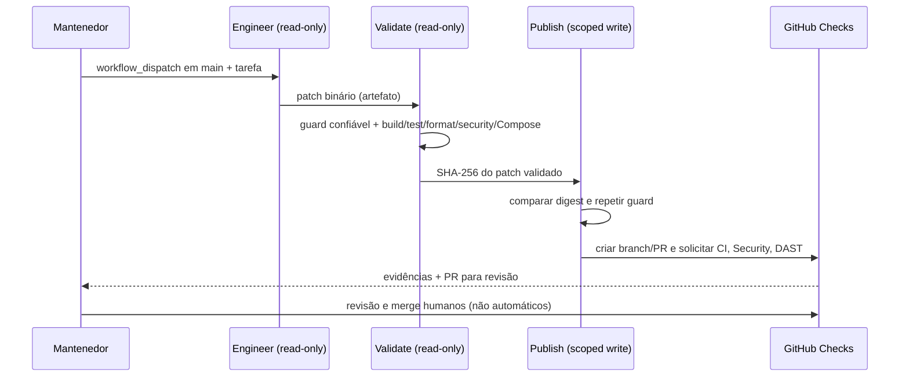

[🇺🇸 English](technical-walkthrough.en.md)

# Walkthrough técnico da plataforma

Esta página é um **guia técnico de inspeção de 5 minutos** para engenheiros, arquitetos, mantenedores e qualquer pessoa que precise compreender ou evoluir o repositório.

O objetivo é facilitar a compreensão das decisões, evidências e guardrails de engenharia sem exigir a leitura de todo o código.

## 1. Identidade, borda e limites dos serviços

Comece pela visão macro:

- [Arquitetura](./architecture.md)
- [Building block de segurança](../src/BuildingBlocks/Security/KeycloakAuthenticationExtensions.cs)
- [Realm Keycloak versionado](../deploy/keycloak/distributed-commerce-realm.json)
- [YARP Gateway](../src/Gateway/ApiGateway/Program.cs)
- [Contratos de eventos](../src/BuildingBlocks/Contracts/IntegrationEvents.cs)

Fluxo de entrada (checkout e cadastro administrativo em caminhos independentes):

```text
Usuário / Administrador
         |
         v
      Keycloak (JWT e roles)
         |
         v
   YARP API Gateway
   (validação JWT e rate limiting)
         |
         +----> Orders API: JWT + ownership --> Checkout / RabbitMQ
         |
         +----> Customers API: JWT + role admin --> CRUD PF/PJ
                                                    |
                                       Customers PostgreSQL
                                                    |
                               Busca CEP opcional --> BrasilAPI v2
```
Depois do comando HTTP, a colaboração entre os quatro serviços de negócio permanece assíncrona:

- Orders
- Inventory
- Payments
- Notifications

Os serviços com estado possuem banco PostgreSQL próprio e não leem tabelas de outro bounded context.

O ponto arquitetural importante é que **Keycloak e YARP fazem parte da plataforma de identidade/borda**, enquanto Customers, Orders, Inventory, Payments e Notifications são bounded contexts de negócio. Customers oferece cadastro administrativo independente do fluxo assíncrono de checkout.


## 2. Clean Architecture

O bounded context de Orders é estruturado intencionalmente em:

```text
Orders.Domain
      ↑
Orders.Application
      ↑
Orders.Infrastructure
      ↑
Orders.Api
```

Arquivos úteis:

- [Agregado Order](../src/Services/Orders/Orders.Domain/Order.cs)
- [Portas da aplicação](../src/Services/Orders/Orders.Application/Abstractions.cs)
- [Caso de uso da aplicação](../src/Services/Orders/Orders.Application/OrderService.cs)
- [Composição da infraestrutura](../src/Services/Orders/Orders.Infrastructure/DependencyInjection.cs)

A camada de domínio não depende de ASP.NET Core, EF Core, RabbitMQ nem MassTransit.

## 3. RabbitMQ e colaboração orientada a eventos

O fluxo completo começa autenticado na borda e depois muda para colaboração assíncrona:

```text
Keycloak -> YARP -> POST /orders
                      |
                      v
                 OrderSubmitted
                      |
                      v
                  Inventory
                      |
          InventoryReserved / Rejected
                      |
                      v
                   Payments
                      |
          PaymentAuthorized / Failed
                      |
                      v
             Orders + Notifications
```

Arquivos úteis:

- [Keycloak security setup](../src/BuildingBlocks/Security/KeycloakAuthenticationExtensions.cs)
- [YARP Gateway](../src/Gateway/ApiGateway/Program.cs)
- [Orders API e configuração do MassTransit](../src/Services/Orders/Orders.Api/Program.cs)
- [Consumer de Inventory](../src/Services/Inventory/Inventory.Service/OrderSubmittedConsumer.cs)
- [Consumer de Payments](../src/Services/Payments/Payments.Service/InventoryReservedConsumer.cs)
- [Consumers de Notifications](../src/Services/Notifications/Notifications.Service/PaymentConsumers.cs)


## 4. Confiabilidade: Outbox, Inbox e idempotência

O repositório trata intencionalmente o problema de dual-write em sistemas distribuídos.

Orders usa MassTransit EF Core Bus Outbox para que a persistência do pedido e a intenção da mensagem de saída compartilhem o mesmo limite de persistência.

Consumers com estado usam suporte inbox/outbox e proteção contra duplicidade no nível de negócio.

Evidências úteis:

- [Orders DbContext / entidades de outbox](../src/Services/Orders/Orders.Infrastructure/OrdersDbContext.cs)
- [Inventory DbContext / inbox-outbox](../src/Services/Inventory/Inventory.Service/InventoryDbContext.cs)
- [Payments DbContext / inbox-outbox](../src/Services/Payments/Payments.Service/PaymentsDbContext.cs)
- [ADR: Transactional Outbox](./adr/0002-transactional-outbox.md)
- [ADR: Idempotência e consistência eventual](./adr/0003-idempotency-eventual-consistency.md)

## 5. Observabilidade

A plataforma usa um building block de OpenTelemetry independente de fornecedor.

Evidências úteis:

- [Building block compartilhado de telemetria](../src/BuildingBlocks/Observability/PlatformTelemetry.cs)
- [Notas de arquitetura sobre observabilidade](./architecture.md#observabilidade)

O código expõe spans e métricas customizados via OTLP. O ambiente local inclui OpenTelemetry Collector, Tempo, Prometheus e Grafana.

## 6. Testes e entrega

Evidências úteis:

- [Testes do domínio de Order](../tests/Orders.Domain.Tests/OrderTests.cs)
- [Integração real com PostgreSQL via Testcontainers](../tests/Orders.Persistence.IntegrationTests/OrderRepositoryTests.cs)
- [GitHub Actions CI](../.github/workflows/ci.yml)
- [Docker Compose](../docker-compose.yml)
- [Exemplos de Kubernetes](../deploy/k8s/README.md)

O pipeline de CI valida:

- restore de dependências;
- build em Release;
- testes automatizados;
- cobertura de código;
- quality gate Sonar/.editorconfig/dotnet format;
- testes unitários e Testcontainers;
- build do Gateway + quatro serviços;
- smoke test do fluxo Keycloak → YARP → Orders usando o perfil Vault;
- existência de usuário PostgreSQL efêmero criado pelo Vault;
- ausência de connection string efetivo no environment da aplicação;
- renovação real do lease durante o CI.

## 7. Segurança e identidade

Evidências úteis:

- [Building block de segurança](../src/BuildingBlocks/Security/KeycloakAuthenticationExtensions.cs)
- [Realm local versionado](../deploy/keycloak/distributed-commerce-realm.json)
- [Smoke test de autenticação/autorização](../scripts/auth-smoke.sh)
- [ADR de identidade](./adr/0004-identity-keycloak.md)

O projeto demonstra validação JWT, audience/issuer checks, RBAC e object-level authorization. O CustomerId não é confiado ao payload: ele vem do `sub` autenticado.

A autenticação HTTP é intencionalmente validada em duas camadas:

```text
Cliente
  -> Keycloak
  -> YARP Gateway
  -> Orders
```

Keycloak autentica e emite o JWT. O YARP valida o token e aplica rate limiting; Orders valida novamente issuer/audience/signature/lifetime e executa a autorização de recurso.

A camada de segredos usa HashiCorp Vault com token/policy por workload. RabbitMQ fica no KV v2; PostgreSQL usa credenciais dinâmicas. Orders, Inventory e Payments recebem logins temporários de runtime com TTL + lease renovável, enquanto migrations usam identidades Vault separadas com DDL e lifecycle curto.

Evidências:

- [Loader de secrets e credenciais dinâmicas](../src/BuildingBlocks/Secrets/VaultConfigurationExtensions.cs)
- [Renovação de lease](../src/BuildingBlocks/Secrets/VaultLeaseRenewalService.cs)
- [Bootstrap Database Secrets Engine](../deploy/vault/vault-init.sh)
- [Overlay Vault](../docker-compose.vault.yml)
- [ADR-0006 — cofre de segredos](./adr/0006-secrets-hashicorp-vault.md)
- [ADR-0007 — credenciais PostgreSQL dinâmicas](./adr/0007-dynamic-postgresql-credentials.md)

## 8. Experiência de desenvolvimento com .NET Aspire

O repositório também demonstra preocupação com **developer experience** e onboarding técnico.

Evidências:

- [Aspire AppHost](../src/Platform/DistributedCommerce.AppHost/AppHost.cs)
- [Projeto do AppHost](../src/Platform/DistributedCommerce.AppHost/DistributedCommerce.AppHost.csproj)
- [Guia de desenvolvimento local](./local-development.md)
- [ADR-0008 — Aspire local](./adr/0008-dotnet-aspire-local-orchestration.md)

Um novo desenvolvedor pode subir a topologia local com:

```bash
dotnet run --project src/Platform/DistributedCommerce.AppHost
```

O AppHost mantém Keycloak, Vault, RabbitMQ e os quatro PostgreSQL em containers, enquanto Gateway e os cinco serviços .NET rodam como projetos locais. Isso preserva credenciais PostgreSQL dinâmicas e lease renewal sem sacrificar breakpoints, logs por recurso e telemetria central no Aspire Dashboard.

Docker Compose continua sendo o caminho de paridade exercitado pelo CI.

### Cadastro administrativo PF/PJ (Customers)

- [Endpoints do CRUD e CEP](../src/Services/Customers/Customers.Api/CustomerEndpoints.cs)
- [Agregado Customer e invariantes de endereços](../src/Services/Customers/Customers.Domain/Customer.cs)
- [Adapter da BrasilAPI CEP v2](../src/Services/Customers/Customers.Infrastructure/BrasilApiPostalCodeLookup.cs)
- [Migration e snapshot EF Core](../src/Services/Customers/Customers.Infrastructure/Migrations/CustomersDbContextModelSnapshot.cs)
- [Teste preventivo de drift das migrations](../tests/Customers.Infrastructure.Tests/CustomersMigrationModelTests.cs)
- [Smoke autenticado PF/PJ](../scripts/customers-smoke.sh)
- [ADR-0013 — cadastro PF/PJ e CEP](./adr/0013-customers-pf-pj-brasilapi-cep.md)

A rota `/api/customers` é protegida por role `admin` no Gateway e no serviço, com PostgreSQL dedicado e credenciais dinâmicas de runtime separadas das de migration. A API expõe `POST`, `GET` (lista e detalhe), `PUT`, `DELETE` e consulta de CEP, suportando CPF (`Individual`) e CNPJ (`Company`), contatos e de 1 a 10 endereços com exatamente um principal. Veja o [diagrama da jornada de cadastro](./architecture.md#fluxo-do-cadastro-de-pessoas-pf-e-pj). O adapter envia **somente o CEP** à BrasilAPI; CPF/CNPJ são validados localmente. O CI exercita o CRUD e valida o snapshot das migrations, além de analisar as APIs com ZAP autenticado.

## 9. Automação de engenharia com IA

Evidências úteis:

- [AGENTS.md](../AGENTS.md)
- [Constituição de engenharia](../.ai/engineering-constitution.md)
- [Workflow AI Evolution Harness](../.github/workflows/ai-evolution.yml)
- [Guard de alterações de governança](../scripts/ai-change-guard.py)
- [Testes do guard em repositórios Git isolados](../tests/ai_harness/test_ai_change_guard.py)
- [Guia operacional AI-First](./ai-first-operations.md)
- [ADR do harness](./adr/0005-ai-engineering-harness.md)

**Implementação integrada:** os PRs [#17](https://github.com/WillianZanutoOliveira/distributed-commerce-platform/pull/17), [#18](https://github.com/WillianZanutoOliveira/distributed-commerce-platform/pull/18) e [#19](https://github.com/WillianZanutoOliveira/distributed-commerce-platform/pull/19) disponibilizaram guard fail-closed, testes Git isolados, proposta revisada e o workflow efetivo na `main`.



Os jobs possuem **permissões separadas**: somente leitura para `engineer` e `validate`; `contents: write`, `pull-requests: write` e `actions: write` apenas para `publish`. O agente não pode modificar `.ai/`, `.github/workflows/`, `docs/governance/`, `tests/ai_harness/` ou os arquivos individuais de política; o verificador inspeciona mudanças committed, staged, unstaged e untracked a partir de SHA-base imutável.

**Estado:** o YAML foi integrado, com CI e Security do PR #19 aprovados, mas uma execução end-to-end com Codex e criação real de PR **ainda não foi confirmada**. A [issue #15](https://github.com/WillianZanutoOliveira/distributed-commerce-platform/issues/15) permanece aberta até passar o teste controlado descrito no [guia operacional](ai-first-operations.md).

## 10. Clean Code e DevSecOps

Evidências úteis:

- [Regras compartilhadas](../.editorconfig)
- [SonarAnalyzer no build](../Directory.Build.props)
- [Pipeline de segurança](../.github/workflows/security.yml)
- [Guia de qualidade](./code-quality.md)

O build trata warnings como erros e o CI verifica formatação/analyzers. O pipeline separado executa CodeQL, Trivy e gera SBOM SPDX.

## 11. Decisões de arquitetura

Os ADRs documentam trade-offs, e não apenas detalhes de implementação:

- [ADR-0001 — Serviços orientados a eventos e Clean Architecture](./adr/0001-event-driven-clean-architecture.md)
- [ADR-0002 — Transactional Outbox](./adr/0002-transactional-outbox.md)
- [ADR-0003 — Idempotência e consistência eventual](./adr/0003-idempotency-eventual-consistency.md)
- [ADR-0004 — Identidade e autorização com Keycloak](./adr/0004-identity-keycloak.md)
- [ADR-0005 — Harness de engenharia assistida por IA](./adr/0005-ai-engineering-harness.md)
- [ADR-0006 — Gestão centralizada de segredos com HashiCorp Vault](./adr/0006-secrets-hashicorp-vault.md)
- [ADR-0007 — Credenciais PostgreSQL dinâmicas com Vault Database Secrets Engine](./adr/0007-dynamic-postgresql-credentials.md)
- [ADR-0008 — .NET Aspire como orquestrador de desenvolvimento local](./adr/0008-dotnet-aspire-local-orchestration.md)
- [ADR-0009 — Service Defaults, health model, OpenAPI e proteção de borda](./adr/0009-service-defaults-api-resilience.md)
- [ADR-0010 — Software supply chain e releases atestados](./adr/0010-software-supply-chain.md)
- [ADR-0011 — EF Core Migrations com identidade Vault de deployment separada](./adr/0011-ef-migrations-vault-deployment-identity.md)
- [ADR-0012 — Guardrails arquiteturais, contratos, fault injection e progressive delivery](./adr/0012-architecture-contract-chaos-gitops.md)
- [ADR-0013 — Cadastro de clientes PF/PJ e busca CEP com BrasilAPI](./adr/0013-customers-pf-pj-brasilapi-cep.md)

## O que este repositório pretende demonstrar

Este repositório não é apresentado como um sistema de produção nem como prova de que todo produto deveria usar microsserviços.

Ele é uma referência pública de engenharia criada para tornar inspecionáveis as seguintes preocupações:

- limites arquiteturais;
- mensageria assíncrona;
- entrega confiável de eventos;
- idempotência;
- consistência eventual;
- observabilidade;
- entrega containerizada;
- quality gates em CI;
- trade-offs técnicos explícitos.


## 12. Service Defaults, contrato e proteção de borda

Evidências:

- [Service Defaults](../src/BuildingBlocks/ServiceDefaults/PlatformServiceDefaults.cs)
- [Gateway com rate limiting](../src/Gateway/ApiGateway/Program.cs)
- [Orders OpenAPI](../src/Services/Orders/Orders.Api/Program.cs)
- [Teste de topologia Aspire](../tests/DistributedCommerce.AppHost.Tests/LocalTopologyTests.cs)
- [ADR-0009](./adr/0009-service-defaults-api-resilience.md)

O projeto demonstra readiness/liveness separados, service discovery, resiliência HTTP default, rate limiting por identidade e contrato OpenAPI verificável.

## 13. Software supply chain e container hardening

Evidências:

- [OpenSSF Scorecard](../.github/workflows/scorecard.yml)
- [Security pipeline](../.github/workflows/security.yml)
- [Release OCI atestado](../.github/workflows/release.yml)
- [CODEOWNERS](../.github/CODEOWNERS)
- [Security Policy](../SECURITY.md)
- [Kubernetes hardening](../deploy/k8s/services.yaml)
- [ADR-0010](./adr/0010-software-supply-chain.md)

O repositório demonstra pinning de GitHub Actions por commit, CodeQL, Trivy, SBOM, OpenSSF Scorecard, containers non-root, Kubernetes securityContext e provenance attestations para imagens publicadas.


## 14. Migrations com least privilege

Evidências:

- [DatabaseMigrator](../src/Platform/DatabaseMigrator/Program.cs)
- [Orders migrations](../src/Services/Orders/Orders.Infrastructure/Migrations)
- [Vault runtime/migration roles](../deploy/vault/vault-init.sh)
- [PostgreSQL role split](../deploy/postgres/orders-init.sql)
- [ADR-0011](./adr/0011-ef-migrations-vault-deployment-identity.md)

Ponto técnico: a aplicação não possui DDL. Um migrator one-shot recebe credencial dinâmica curta do Vault, aplica EF Migrations e termina; runtime recebe somente DML.

## 15. Architecture, contract e chaos testing

Evidências:

- [Architecture Tests](../tests/Architecture.Tests)
- [Contract Compatibility Tests](../tests/Contracts.Compatibility.Tests)
- [Chaos Tests](../tests/Chaos.Tests)

Esses gates mostram que arquitetura, compatibilidade de eventos e comportamento diante de falha de rede são verificáveis no pipeline.

## 16. GitOps e canary

Evidências:

- [Argo CD Application](../deploy/gitops/argocd/orders-production.yaml)
- [Argo Rollout](../deploy/gitops/orders-canary/rollout.yaml)
- [Canary analysis](../deploy/gitops/orders-canary/analysis-template.yaml)
- [PreSync migration Job](../deploy/gitops/orders-canary/migration-job.yaml)
- [GitOps Promotion workflow](../.github/workflows/gitops-promote.yml)
- [ADR-0012](./adr/0012-architecture-contract-chaos-gitops.md)

A história técnica é: build e assinatura do artefato são separados da promoção; promoção gera PR; Argo CD reconcilia Git; migration precede o rollout; Argo Rollouts promove gradualmente com análise automática.


## 17. Pentest readiness e threat boundaries

Evidências:

- [Security posture](./security-posture.md)
- [Keycloak realm](../deploy/keycloak/distributed-commerce-realm.json)
- [JWT security building block](../src/BuildingBlocks/Security/KeycloakAuthenticationExtensions.cs)
- [HTTP hardening](../src/BuildingBlocks/ServiceDefaults/PlatformWebSecurityExtensions.cs)
- [Security invariant checks](../scripts/security-config-check.sh)
- [Adversarial API smoke](../scripts/security-smoke.sh)
- [Authenticated ZAP DAST](../.github/workflows/dast.yml)

O caminho externo é deliberadamente tratado como não confiável:

```text
Cliente
  |
  v
Keycloak
  |
  | JWT RS256
  v
YARP Gateway
  |
  | issuer/audience/lifetime + rate limiting
  v
Orders
  |
  | JWT validado novamente
  | CustomerId = sub
  | query OrderId + CustomerId
  v
PostgreSQL / RabbitMQ
```

Pontos que um avaliador de segurança consegue inspecionar diretamente:

- `fullScopeAllowed=false` nos clients do realm local, com scope mapping explícito apenas para `customer` e `admin`;
- brute-force protection e access token curto no Keycloak local;
- metadata Keycloak precisa ser HTTPS fora de Development;
- token adulterado retorna 401;
- acesso cross-customer retorna 404 e não revela existência do pedido;
- payload não pode injetar `CustomerId`;
- JSON desconhecido é rejeitado;
- body/headers/request-line são limitados;
- TRACE/CONNECT são bloqueados;
- security headers são adicionados;
- rate limiter retorna 429 sob burst;
- appsettings não possuem credenciais default;
- containers .NET são non-root;
- Vault separa runtime DML de migration DDL;
- ZAP executa active scan autenticado contra uma stack descartável.

A meta não é afirmar “invulnerável”; é manter **zero findings High/Critical conhecidos nos gates automatizados** e transformar findings reais em regression tests.

## 18. Como demonstrar a arquitetura em uma entrevista

Uma sequência curta e forte:

1. mostrar o diagrama principal com **Keycloak → YARP → Orders → RabbitMQ**;
2. explicar por que Orders valida JWT novamente;
3. mostrar Vault emitindo credenciais dinâmicas de runtime e migration;
4. mostrar o `DatabaseMigrator` one-shot e a ausência de DDL na aplicação;
5. abrir os architecture/contract/chaos tests;
6. mostrar CI, Security e DAST como gates separados;
7. finalizar com GitOps/Argo Rollouts e promoção por PR.

Isso demonstra arquitetura distribuída, segurança, plataforma, qualidade e operação como um único desenho coerente.
